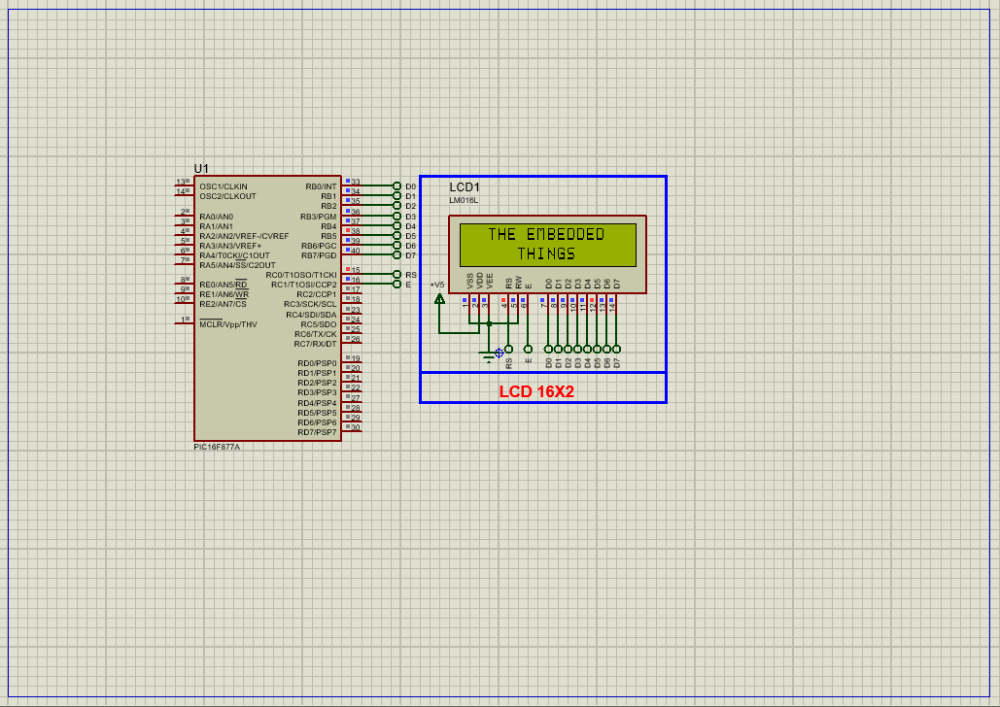

# Enhanced 8-bit LCD Interface for PIC16F877A

This project demonstrates how to interface a **16×2 Alphanumeric LCD** (based on the **Hitachi HD44780 controller**) with a **PIC16F877A microcontroller** using an 8-bit parallel interface. The project displays messages on the LCD using custom functions to initialize, control, and print text to the screen.

---

## Hardware Requirements  
  
- **PIC16F877A Microcontroller**  
- **16×2 LCD Module (HD44780-based)**  
- **10K Potentiometer** (for contrast adjustment)  
- **330Ω Resistors** (if using backlit LED)  
- **4MHz or 10MHz Crystal Oscillator** + **2x 22pF Capacitors**  
- **5V DC Power Supply**

---

## Circuit Overview  
- **LCD Interface** (8-bit parallel):  
  - Data Pins (D0–D7) → PORTB  
  - RS (Register Select) → RC0  
  - EN (Enable) → RC1  
- **Control**:  
  - RS = 0 → Instruction mode  
  - RS = 1 → Data mode  
  - EN → Latches command/data  
- **Power Supply**:  
  - VDD = +5V, VSS = GND  
- **Oscillator**:  
  - External XTAL @ 10MHz or 4MHz (adjust delay accordingly)

---

## Software Requirements  
- **MPLAB X IDE** (v5.50+)  
- **XC8 Compiler** (v2.36+)  
- **Proteus 8.15+** (for simulation and testing)

---

## LCD Overview and Operation  
- **16x2 Display**: Shows 2 lines × 16 characters each  
- **Controlled by HD44780 Driver**  
- **Registers Used**:  
  - **IR (Instruction Register)** → Command handling  
  - **DR (Data Register)** → Character display  
- **Memory Components**:  
  - **DDRAM** → Stores display characters  
  - **CGRAM** → Stores custom characters  
  - **CGROM** → Contains fixed 5x8 or 5x10 dot characters  
- **Busy Flag**: DB7 indicates internal processing  
- **Address Counter (AC)**: Tracks current DDRAM/CGRAM address  

---

## Code Functionality Overview  
### Key Features (Described Only):

1. **LCD Initialization**  
   - Sets function mode, enables display, and clears screen  
   - Sets cursor control (blink ON, shift OFF)

2. **Core Functions**  
   - `sendCommandToLCD()` → Sends control commands  
   - `sendDataToLCD()` → Sends characters to display  
   - `printToLCD()` → Prints strings  
   - `moveCursorToPosition()` → Moves cursor to specific line address  
   - `clearLCD()` → Clears the screen

3. **Main Loop**  
   - Clears LCD  
   - Writes `"  THE EMBEDDED  "` to the first line  
   - Writes `"     THINGS     "` to the second line  
   - Repeats every 2 seconds  

---

## Proteus Simulation Instructions  
1. **Open Proteus** and create a new project  
2. **Pick Devices**:  
   - PIC16F877A  
   - LCD 16x2 (HD44780 compatible)  
   - Optional: Potentiometer (for contrast), crystal, and caps  
3. **Connections**:  
   - PORTB → LCD D0–D7  
   - RC0 → LCD RS  
   - RC1 → LCD EN  
   - Use DEFAULT, POWER, and GROUND from Terminal Mode  
4. **Run Simulation**:  
   - Load the `.hex` file into the PIC  
   - LCD displays text with 2-second refresh

---

## Real-World Applications  
- **Embedded Dashboards**: Display system states, metrics, or alarms  
- **User Interfaces**: Menus, messages, setup info  
- **Sensor Monitoring**: Show real-time readings  
- **Custom Character Animations**: Use CGRAM for visual effects  

---

## Troubleshooting Guide

| Symptom                  | Possible Cause                      | Suggested Fix                        |
|--------------------------|--------------------------------------|--------------------------------------|
| LCD shows nothing        | Contrast not set or wrong wiring     | Adjust potentiometer / check pins    |
| Gibberish characters     | Data mismatch or RS/EN misconfigured | Verify command/data timing           |
| Only one line displays   | Initialization incomplete            | Confirm all LCD commands are sent    |
| No backlight             | LED pins not powered                 | Power the backlight separately       |

---

## License  
**MIT License** — Free to use with attribution
