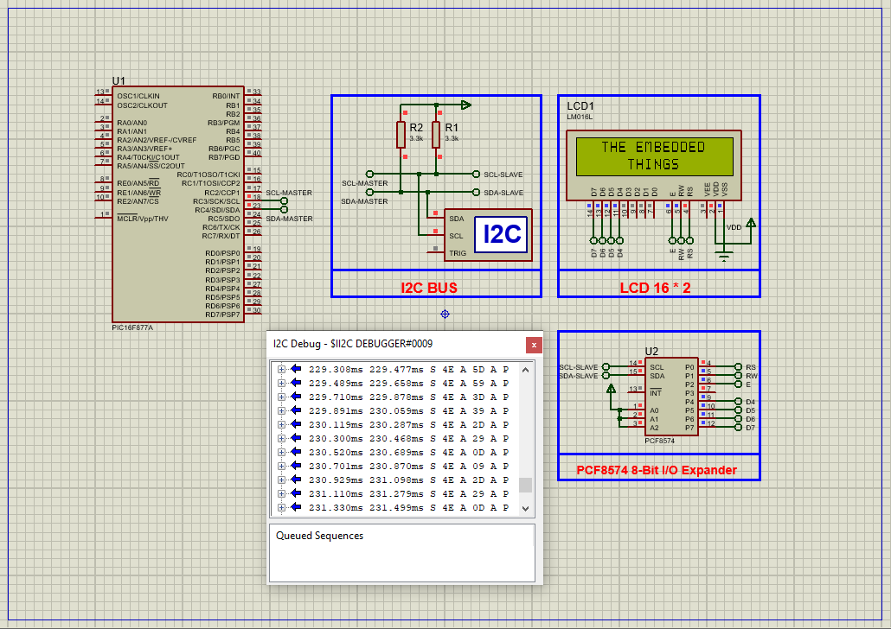

# I2C LCD Interface with PIC16F877A

This project demonstrates how to interface a **16×2 Alphanumeric LCD** with the **PIC16F877A microcontroller** using the **PCF8574 I2C I/O Expander**. It reduces pin usage and simplifies wiring by enabling serial communication over the I2C protocol. This setup is efficient for display applications in embedded systems requiring minimal GPIO usage.

---

## Hardware Requirements  
  
- **PIC16F877A Microcontroller**  
- **16×2 LCD Module with I2C Adapter (PCF8574)**  
- **10k Potentiometer** (for LCD contrast)  
- **4MHz or 16MHz Crystal Oscillator** + **2x 22pF Capacitors**  
- **I2C Pull-up Resistors (4.7kΩ for SDA & SCL lines)**  
- **5V DC Power Supply**

---

## Circuit Overview  
- **I2C Communication Lines**:  
  - RC3 → SCL (Clock Line)  
  - RC4 → SDA (Data Line)  
- **I2C Device**:  
  - **PCF8574** I/O expander controlling 16×2 LCD  
  - Address configurable via A0–A2 jumpers (default: 0x4E)  
- **Backlight & Contrast Control**:  
  - On-board jumper and potentiometer  
- **Power Supply**:  
  - VDD = +5V, VSS = GND

---

## Software Requirements  
- **MPLAB X IDE** (v5.50+)  
- **XC8 Compiler** (v2.36+)  
- **Proteus 8.15+** (for simulation and testing)

---

## PCF8574 I/O Expander Overview  
- **Expands GPIO via I2C** (8-bit ports)  
- **Default power-up state**: HIGH (weak internal pull-up)  
- **Configurable slave address via A0–A2 pins**  
- **Sink capability**: Up to 80mA  
- **Interrupt support**: Active LOW open-drain output  
- Ideal for **LED control, keypads, and displays**

---

## Code Functionality Overview  
### Key Features (Described Only):

1. **I2C Communication Setup**  
   - Master mode at 100kHz  
   - Uses SSP module for data transfer  
   - Functions for start, stop, write, wait handling

2. **LCD Initialization**  
   - Sends command sequences over I2C  
   - Sets cursor mode, display on, entry mode  
   - Clears screen and sets to home position  

3. **LCD Operations**  
   - `LCD_Print_String()` – Prints ASCII string  
   - `LCD_Set_Cursor()` – Sets cursor by row and column  
   - `LCD_CMD()` – Sends command  
   - `LCD_Print_Char()` – Displays single character  
   - `LCD_SR()` / `LCD_SL()` – Scrolls display right/left  
   - `Backlight()` / `noBacklight()` – Controls LCD backlight  

4. **Main Loop Logic**  
   - Initializes LCD at address `0x4E`  
   - Displays "THE EMBEDDED" on line 1 and "THINGS" on line 2  
   - Scrolls text left/right in a loop  

---

## Proteus Simulation Instructions  
1. **Open Proteus** and create a new project  
2. **Pick Devices**:  
   - PIC16F877A  
   - 16×2 LCD with I2C Adapter (PCF8574)  
   - I2C DEBUGGER (optional for monitoring bus)  
   - Resistors, Crystal, Power, and Ground  
3. **Connections**:  
   - RC3 → SCL, RC4 → SDA  
   - Ensure correct PCF8574 I2C address (default: 0x4E)  
   - Add pull-up resistors to SDA/SCL  
4. **Run Simulation**:  
   - Load the compiled `.hex` file into PIC  
   - Observe the LCD scrolling and displaying messages  

---

## Applications  
- **User Interfaces**: Menu-based LCD UIs for embedded systems  
- **Sensor Readouts**: Display environmental, health, or industrial readings  
- **Portable Devices**: Reduce pin usage while maintaining display functionality  
- **I2C Bus Expansion**: Multiple displays or devices on same bus  

---

## Troubleshooting Guide

| Symptom                  | Possible Cause                    | Suggested Fix                        |
|--------------------------|------------------------------------|--------------------------------------|
| LCD shows nothing        | I2C not initialized or miswired    | Verify SDA/SCL pins and pull-ups     |
| Gibberish on screen      | Incorrect LCD command timing       | Check LCD init sequence              |
| LCD doesn't scroll       | Function not called or wrong delay | Verify loop logic and `__delay_ms()` |
| Backlight not working    | Jumper disabled or no control code | Check `Backlight()` function and jumper|

---

## License  
**MIT License** — Free to use with attribution
