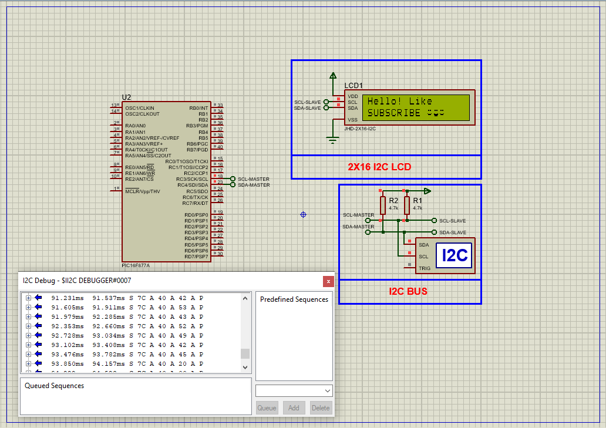

# JHD-2X16-I2C LCD Control with PIC16F877A

This project showcases an advanced I2C interface between a **PIC16F877A microcontroller** and a **JHD-2X16 I2C LCD module** powered by the **HD44780 controller**. It features custom character creation, scrolling, cursor control, and display configuration—demonstrating a complete alphanumeric visualization system using minimal I/O lines via the I2C protocol.

---

## Hardware Requirements  
  
- **PIC16F877A Microcontroller**  
- **JHD-2X16 I2C LCD Module** (HD44780-based)  
- **PCF8574 I/O Expander (integrated in module)**  
- **4.7kΩ Pull-Up Resistors** (SCL, SDA lines)  
- **10k Potentiometer** (for contrast adjustment)  
- **4MHz or 16MHz Crystal Oscillator** + **2x 22pF Capacitors**  
- **5V DC Power Supply**

---

## Circuit Overview  
- **I2C Communication**  
  - RC3 (SCL) ↔ I2C Clock Line  
  - RC4 (SDA) ↔ I2C Data Line  
- **LCD Address**: Default I2C Address = `0x7C`  
- **Backlight and Contrast**  
  - Adjustable via on-board potentiometer and jumper  
- **Power Supply**  
  - VDD = +5V, VSS = GND  

---

## Software Requirements  
- **MPLAB X IDE** (v5.50+)  
- **XC8 Compiler** (v2.36+)  
- **Proteus 8.15+** (for simulation and testing)

---

## HD44780 Controller Features  
- **Character Display**: Supports 5×8 and 5×10 formats  
- **Memory**:  
  - DDRAM: 80×8-bit (32 visible chars at a time)  
  - CGRAM: 64 bytes for 8 custom characters  
  - CGROM: 240 predefined fonts  
- **Interfaces**:  
  - 4-bit and 8-bit parallel modes  
  - Supports MPU up to 2 MHz  
- **Functions**:  
  - Cursor control, blinking, display shift  
  - Auto-scroll, text direction, command handling  

---

## Code Functionality Overview  
### Key Features (Described Only):

1. **Initialization & System Setup**  
   - I2C master initialized at 100kHz  
   - LCD initialized and cleared  
   - Two custom characters (smiley and laughing face) defined in CGRAM  

2. **Display Functions**  
   - `LCD_Print_String()` – Print full text  
   - `LCD_Print_Char()` – Print character or custom glyph  
   - `LCD_SetCursor()` – Move cursor to (row, col)  
   - `LCD_Command()` – Send raw command to controller  

3. **Demonstration Loop**  
   - **Basic Printing**: Display message + smiley faces  
   - **Auto-Scroll**: Print dots while scrolling text  
   - **Cursor/Blink Control**: Toggle cursor and blink options  
   - **Display ON/OFF**: Demonstrate screen toggle  
   - **Text Direction**: Switch between LTR and RTL  
   - **Scroll Commands**: Shift content left/right  
   - **Return Home**: Reset cursor to origin  

---

## Proteus Simulation Instructions  
1. **Create New Project** in Proteus  
2. **Pick Devices**:  
   - PIC16F877A  
   - JHD-2X16-I2C LCD (via PCF8574)  
   - 4.7kΩ Pull-Up Resistors (SCL & SDA)  
   - Optional: Potentiometer (contrast)  
3. **Wiring**:  
   - RC3 ↔ SCL  
   - RC4 ↔ SDA  
   - VDD = +5V, VSS = GND  
4. **Terminal Mode**:  
   - Choose `DEFAULT`, `POWER`, `GROUND`  
5. **Run Simulation**:  
   - Load `.hex` file  
   - Observe text output, animations, and custom glyphs  

---

## Applications  
- **Interactive Displays**: Embedded menus, system info  
- **Custom Indicators**: Use custom characters for icons  
- **Status Screens**: Sensor values, logs, alerts  
- **Low-I/O Designs**: Minimize GPIO pin usage with I2C  

---

## Troubleshooting Guide

| Symptom                    | Likely Cause                         | Solution                             |
|----------------------------|---------------------------------------|--------------------------------------|
| No display on LCD          | Contrast not adjusted / miswiring     | Tune potentiometer, check SDA/SCL    |
| Incorrect characters       | Improper initialization or timing     | Check LCD_Init sequence              |
| I2C not responding         | Wrong address or bus conflict         | Confirm device address (0x7C)        |
| No backlight               | Jumper disabled or dimmed contrast    | Enable jumper and adjust contrast    |

---

## License  
**MIT License** — Free to use with attribution
