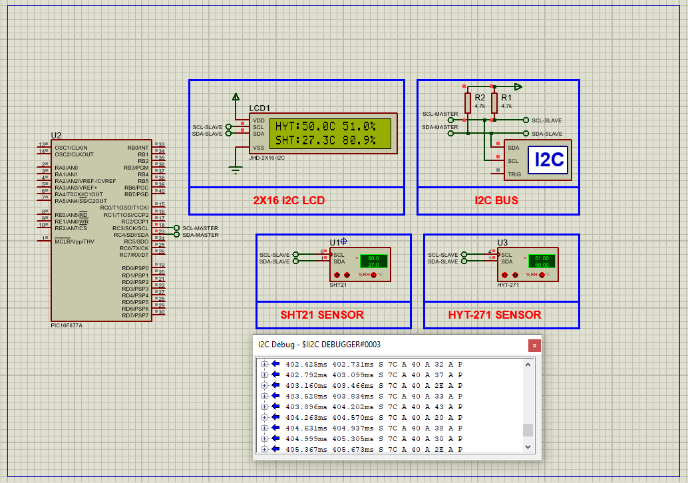

# PIC16F877A I2C Temperature & Humidity Monitoring with LCD

This project demonstrates real-time temperature and humidity data acquisition using **HYT271** and **SHT21 I²C sensors** interfaced with a **PIC16F877A microcontroller**. Both sensor readings are displayed simultaneously on a **16×2 I2C LCD**, showcasing dual-sensor integration, digital I²C communication, and formatted data visualization in embedded systems.

---

## Hardware Requirements  
  
- **PIC16F877A Microcontroller**  
- **HYT-271 I²C Temperature & Humidity Sensor**  
- **SHT21 I²C Temperature & Humidity Sensor**  
- **JHD-2X16 I²C LCD (HD44780 Controller)**  
- **4.7kΩ Pull-Up Resistors** (SCL, SDA lines)  
- **5V Power Supply**  
- **Crystal Oscillator (4–16MHz)** + **22pF Capacitors**

---

## Circuit Overview  
- **I²C Communication**  
  - RC3 (SCL) ↔ I²C Clock Line  
  - RC4 (SDA) ↔ I²C Data Line  
- **I²C Devices**  
  - HYT271 @ I²C Address: `0x28`  
  - SHT21  @ I²C Address: `0x40`  
  - LCD    @ I²C Address: `0x7C`  
- **Power**  
  - VDD = +5V, VSS = GND  

---

## Software Requirements  
- **MPLAB X IDE** (v5.50+)  
- **XC8 Compiler** (v2.36+)  
- **Proteus 8.15+** (for simulation)  

---

## Sensor Features  

### HYT-271 (IST AG)  
- **Range**: 0–100% RH, -40°C to +125°C  
- **Accuracy**: ±1.8% RH, ±0.2°C  
- **Interface**: I²C  
- **Low power**, dew/chemical resistant  

### SHT21 (Sensirion)  
- **Compact DFN-3x3mm** sensor  
- **Accuracy**: ±2% RH, ±0.3°C  
- **12/14-bit digital I²C output**  
- Individually calibrated and tested  

---

## Code Functionality Overview  

### 1. **Initialization**  
- `HYT271_Init()` and `LCD_Init()` setup communication and display.  

### 2. **Sensor Reading**  
- HYT-271:  
  - `HYT271_StartMeasurement()`  
  - `HYT271_GetTemperature()`  
  - `HYT271_GetHumidity()`  
- SHT21:  
  - `SHT2x_GetTemperature()`  
  - `SHT2x_GetHumidity()`  

### 3. **LCD Display Logic**  
- Line 1 → HYT271 values in `HYT:XX.X°C XX.X%` format  
- Line 2 → SHT21 values in `SHT:XX.X°C XX.X%` format  
- Updated every 1 second with `__delay_ms(1000)`  

---

## Proteus Simulation  

### Steps to Simulate:  
1. **Create New Project**  
2. **Pick Devices**:  
   - `PIC16F877A`  
   - `HYT-271`, `SHT21`, `JHD-2X16-I2C`  
   - Optional: I2C Debugger  
3. **Connections**:  
   - RC3 → SCL  
   - RC4 → SDA  
   - VDD → +5V, VSS → GND  
   - Ensure I²C pull-ups (4.7kΩ)  
4. **Run Simulation**:  
   - Load `.hex` file  
   - Monitor temperature & humidity values live on the LCD  

---

## Applications  
- **Environmental Monitoring Systems**  
- **Climate Control (HVAC)**  
- **Weather Stations**  
- **Industrial Automation**  
- **Greenhouse Control Units**

---

## Troubleshooting  

| Symptom               | Likely Cause                  | Solution                          |
|-----------------------|-------------------------------|-----------------------------------|
| No LCD output         | I2C wiring or address error   | Confirm LCD I2C address (0x7C)    |
| No sensor response    | Incorrect address             | HYT271 = 0x28, SHT21 = 0x40       |
| Garbage display       | LCD init error or bad format  | Check LCD_Init sequence and buffer|
| LCD not refreshing    | Delay too short or missing    | Confirm `__delay_ms(1000)` usage  |

---

## License  
**MIT License** — Free to use with attribution
