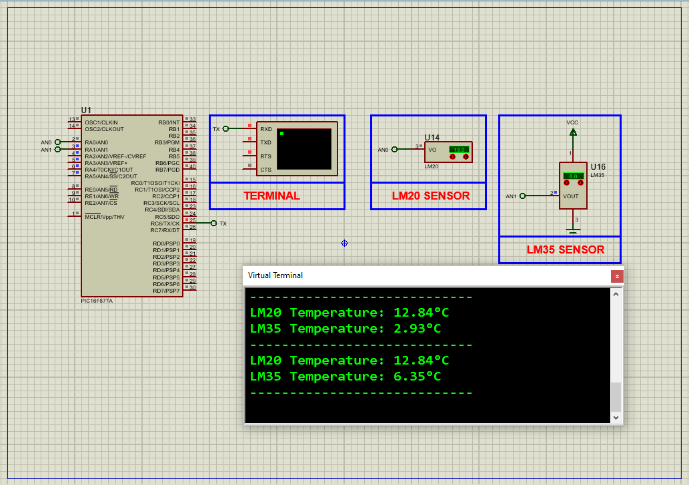

# PIC16F877A Dual Temperature Monitoring using LM20 & LM35 Sensors

This embedded systems project demonstrates a **dual temperature sensing system** using the **PIC16F877A microcontroller**, interfacing both **LM20** and **LM35** analog temperature sensors. The system reads analog voltage outputs from the sensors using the built-in ADC of the PIC and calculates temperature values, which are then displayed over **UART** using a virtual terminal or serial monitor.

---

## Hardware Requirements  


- **PIC16F877A Microcontroller**  
- **LM20 Analog Temperature Sensor**  
- **LM35 Analog Temperature Sensor**  
- **UART Serial Terminal (Proteus Virtual Terminal or USB-to-Serial)**  
- **Resistors (as required)**  
- **Power Supply (5V DC)**  
- **Crystal Oscillator (typically 8 MHz)**  
- **Breadboard & Jumper Wires**

---

## Circuit Overview

- **LM20** → Connected to **AN0** (RA0) of PIC16F877A  
- **LM35** → Connected to **AN1** (RA1) of PIC16F877A  
- **UART TX** → Connected from **RC6** to Virtual Terminal RX  
- **Power Supply**: 5V connected to all active components  
- **ADC Reference Voltage**: Assumed VREF = 5.0V  

---

## Sensor Specifications

### LM35 – Analog Temperature Sensor
- Operating Range: −55°C to +150°C  
- Output: Linear, **10 mV/°C**  
- Accuracy: ±0.25°C (typical at room temp)  
- Voltage at 25°C: **250 mV**  
- No calibration required

### LM20 – Analog Temperature Sensor
- Operating Range: −55°C to +130°C  
- Output: **Parabolic** voltage response  
- Accuracy: ±1.5°C to ±4°C (typical)  
- Very low power consumption (<10 μA)  
- Output at 0°C: ~1.8639V  

---

## Functional Overview

- **Analog Readings via ADC**
  - AN0 → LM20  
  - AN1 → LM35

- **Temperature Conversion**
  - **LM35**:  
    `Temperature (°C) = Vout × 100`  
  - **LM20**:  
    `Temperature (°C) = -1481.96 + sqrt(2.1962e6 + ((1.8639 - Vout) / 3.88e-6))`  

- **UART Display**
  - Transmits formatted readings every 1 second
  - Example output:  
    ```
    LM20 Temperature: 28.64°C  
    LM35 Temperature: 26.50°C  
    ----------------------------
    ```

---

## Proteus Simulation Configuration

### Components to Select:
- `PIC16F877A`  
- `LM20`  
- `LM35`  
- `VIRTUAL TERMINAL`  
- `VCC`, `GND`, `Voltage Probe (optional for debugging)`

### Setup Steps:
1. Open Proteus and create a new project  
2. Place all components and connect:
   - LM20 output → RA0 (AN0)
   - LM35 output → RA1 (AN1)
   - TX (RC6) → RX on Virtual Terminal
3. Set crystal oscillator to **8 MHz**
4. Load the compiled `.hex` file into the PIC16F877A
5. Start simulation and observe readings in terminal

---

## Applications

- **Multi-zone Temperature Sensing**  
- **Industrial and Remote Temperature Monitoring**  
- **Battery-Operated Environmental Trackers**  
- **Embedded System Calibration Tools**  
- **Educational Microcontroller Projects**

---

## Troubleshooting

| Problem                  | Possible Cause                    | Solution                            |
|--------------------------|------------------------------------|-------------------------------------|
| No UART output           | Incorrect baud rate or wiring      | Set UART correctly (e.g., 9600 bps) |
| Inaccurate LM20 reading  | Wrong conversion formula           | Use parabolic equation              |
| All values show 0°C      | ADC input not wired or Vcc fault   | Check sensor and supply wiring      |
| Glitchy output           | Floating ADC inputs or noise       | Add averaging or decoupling caps    |

---

## License  
**MIT License** – Free to use with attribution  
