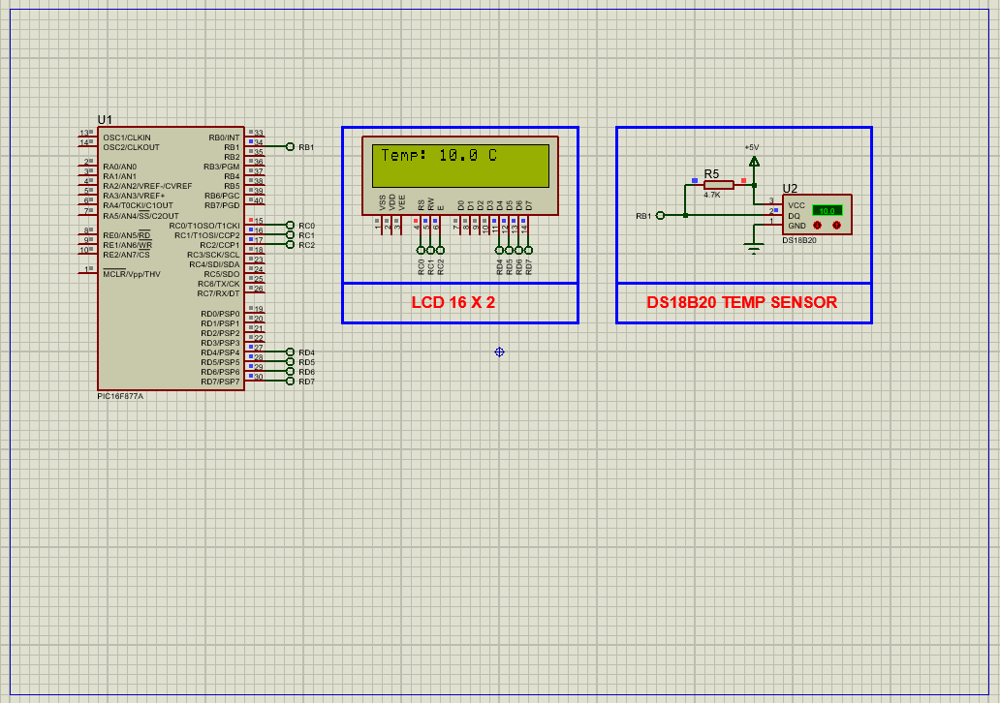

# PIC16F877A Digital Temperature Monitoring using DS18B20 Sensor

This project demonstrates how to **interface a DS18B20 digital temperature sensor** with the **PIC16F877A microcontroller**. The sensor provides highly accurate digital temperature readings, which are displayed on a **16x2 alphanumeric LCD**. It utilizes the **1-Wire communication protocol**, enabling simple connectivity with minimal wiring.

---

## Hardware Requirements  

- **PIC16F877A Microcontroller**  
- **DS18B20 Digital Temperature Sensor**  
- **4.7kΩ Pull-up Resistor** (for 1-Wire data line)  
- **16x2 Alphanumeric LCD**  
- **10k Potentiometer** (for LCD contrast adjustment)  
- **Power Supply (5V DC)**  
- **Crystal Oscillator (20 MHz)**  
- **Breadboard & Jumper Wires**

---

## Circuit Overview

- **DS18B20** → Data pin connected to **RB1** of PIC16F877A  
- **4.7kΩ Resistor** → Connected between DS18B20 Data pin and VCC (pull-up)  
- **LCD Data Pins (D4–D7)** → Connected to **RD4–RD7**  
- **LCD Control Pins (RS, RW, EN)** → Connected to **RC0, RC1, RC2**  
- **Power Supply**: 5V DC to all active components  
- **Contrast**: Controlled via a potentiometer on the VEE pin of LCD

---

## Sensor Specifications

### DS18B20 – Digital Temperature Sensor

- Interface: **1-Wire** Digital Protocol  
- Operating Range: **−55°C to +125°C**  
- Accuracy: ±0.5°C (typical at 25°C)  
- Resolution: Programmable from **9 to 12 bits**  
- Unique 64-bit serial code for each sensor  
- Supports **parasite power** mode (optional)  
- Output: **Digital temperature data** (no ADC required)  

---

## Functional Overview

- **1-Wire Protocol**
  - The DS18B20 communicates using a single-wire protocol requiring precise timing.
  - Includes reset, presence detection, read/write bit, and command operations.

- **Temperature Measurement**
  - Microcontroller sends `0x44` to start temperature conversion.
  - Then reads the scratchpad memory using `0xBE`.
  - Temperature is read as a 16-bit signed integer, multiplied by 0.0625 to convert to °C.

- **LCD Display**
  - Displays result as:  
    `Temp: XX.X C`  
  - If sensor is not detected, displays `Sensor Error!`

---

## Proteus Simulation Configuration

### Components to Select:
- `PIC16F877A`  
- `DS18B20`  
- `Resistor (4.7kΩ)`  
- `LCD 16x2`  
- `Potentiometer (for contrast)`  
- `VCC`, `GND`

### Setup Steps:
1. Open Proteus and create a new project  
2. Place and wire the following:
   - **DS18B20 Data** → **RB1**
   - **Pull-up resistor** (4.7kΩ) from Data to VCC  
   - **LCD control**: RS, RW, EN → RC0, RC1, RC2  
   - **LCD data lines**: D4–D7 → RD4–RD7  
3. Set microcontroller clock to **20 MHz**  
4. Compile and load the `.hex` file into PIC16F877A  
5. Run simulation and observe the LCD

---

## Applications

- **Weather Stations**  
- **HVAC Monitoring Systems**  
- **Refrigeration and Cold Chain Tracking**  
- **Industrial Temperature Control**  
- **Greenhouse Automation**  
- **Embedded Learning Projects**

---

## Troubleshooting

| Problem               | Possible Cause               | Solution                              |
|-----------------------|-------------------------------|----------------------------------------|
| No temperature shown  | DS18B20 not responding        | Check 4.7kΩ pull-up on data line       |
| "Sensor Error!" msg   | Sensor not detected/reset     | Confirm correct pin wiring and delay   |
| Corrupted LCD text    | Wrong timing/data bits        | Add delay or reinitialize LCD properly |
| Incorrect readings    | No conversion delay           | Ensure enough delay after 0x44 command |

---

## License  
**MIT License** – Free to use with attribution  
