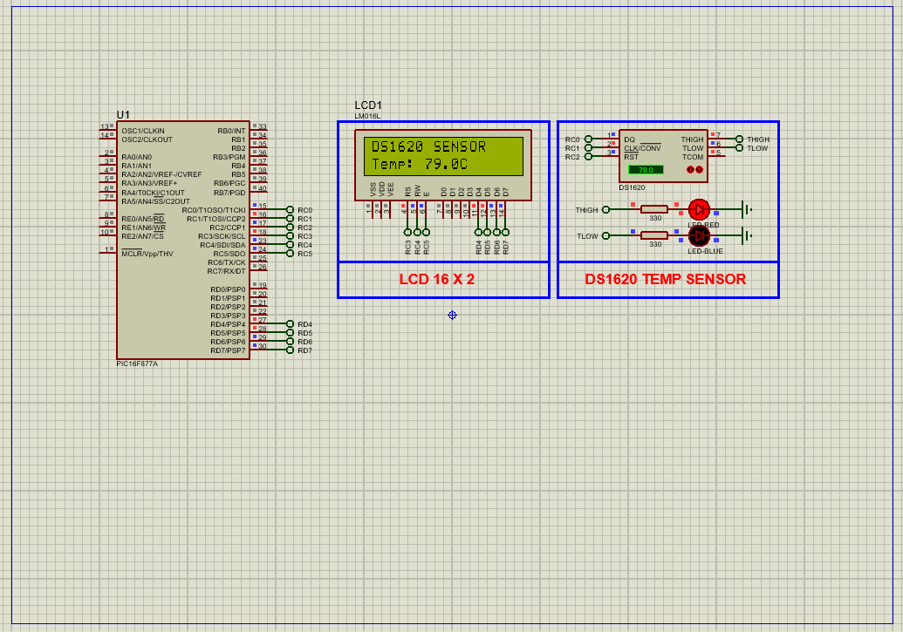

# PIC16F877A Digital Temperature Monitoring using DS1620 Sensor

This embedded project demonstrates **temperature sensing and display** using a **DS1620 digital thermometer** interfaced with a **PIC16F877A microcontroller**. The temperature values are read via the **3-wire interface**, processed with **0.5°C resolution**, and displayed on a **16x2 LCD**. This project also highlights thermostat control and standalone operation capabilities of the DS1620.

---

## Hardware Requirements  

- **PIC16F877A Microcontroller**  
- **DS1620 Digital Temperature Sensor**  
- **16x2 Alphanumeric LCD**  
- **4.7kΩ Resistor** (pull-up for 3-wire interface)  
- **10k Potentiometer** (for LCD contrast)  
- **Red LED** (optional for status or threshold alert)  
- **Power Supply (5V DC)**  
- **Crystal Oscillator (20 MHz)**  
- **Breadboard & Jumper Wires**

---

## Circuit Overview

- **DS1620 Sensor Pins**  
  - **DQ** → Connected to **RC0**  
  - **CLK** → Connected to **RC1**  
  - **RST** → Connected to **RC2**

- **LCD Control Pins**  
  - **RS, RW, EN** → Connected to **RC3, RC4, RC5**  
  - **Data Pins D4–D7** → Connected to **RD4–RD7**

- **Optional LED**: Connect to **PORTB or PORTD** as status indicator  
- **Power**: 5V DC supply for all components  
- **Contrast**: Controlled via potentiometer to LCD VEE pin

---

## Sensor Specifications

### DS1620 – Digital Temperature Sensor

- Temperature Range: **−55°C to +125°C**  
- Resolution: **9-bit**, 0.5°C per LSB  
- Interface: **3-Wire** (DQ, CLK, RST)  
- Supply Voltage: **2.7V – 5.5V**  
- Standalone & CPU-controlled operation  
- Thermostat Outputs: **THIGH, TLOW, TCOM**  
- Conversion Time: **750 ms max**

---

## Functional Overview

- **DS1620 Initialization**
  - Configured to CPU mode for 3-wire communication
  - Starts continuous conversion after configuration

- **Temperature Reading**
  - 9-bit signed data format  
  - Uses 2's complement if negative  
  - Read as integer + 0.5°C (if LSB = 1)

- **LCD Display**
  - Line 1: `DS1620 SENSOR`  
  - Line 2: `Temp: XX.XC`

---

## Proteus Simulation Configuration

### Components to Select:
- `PIC16F877A`  
- `DS1620`  
- `LCD 16x2`  
- `RESISTOR (4.7kΩ)`  
- `RED-LED`  
- `VCC`, `GND`, `Terminal`

### Setup Steps:
1. Open Proteus and create a new project  
2. Add and connect:
   - **DS1620**: Connect DQ → RC0, CLK → RC1, RST → RC2  
   - **LCD**: RS/RW/EN → RC3/RC4/RC5, D4-D7 → RD4–RD7  
   - **Optional LED**: connect to any free port  
3. Power all components with 5V  
4. Compile and load the HEX file into the PIC16F877A  
5. Run the simulation and observe the temperature display

---

## Applications

- **Thermostatic Controls**  
- **HVAC Systems**  
- **Refrigeration Monitoring**  
- **Environmental Monitoring Units**  
- **Embedded System Education**

---

## Troubleshooting

| Problem                  | Possible Cause                 | Suggested Solution                   |
|--------------------------|--------------------------------|---------------------------------------|
| No display on LCD        | Incorrect LCD wiring           | Check RS/RW/EN and D4–D7 connections  |
| "Temp: 0.0C" always shown| DS1620 not responding          | Verify pull-up and correct 3-wire config |
| Garbled text on LCD      | Timing or nibble issues        | Ensure correct 4-bit mode init and delays |
| Wrong temp (signed error)| Misinterpreted 2's complement  | Use proper sign extension on bit 9    |

---

## License  
**MIT License** – Free to use with attribution  
