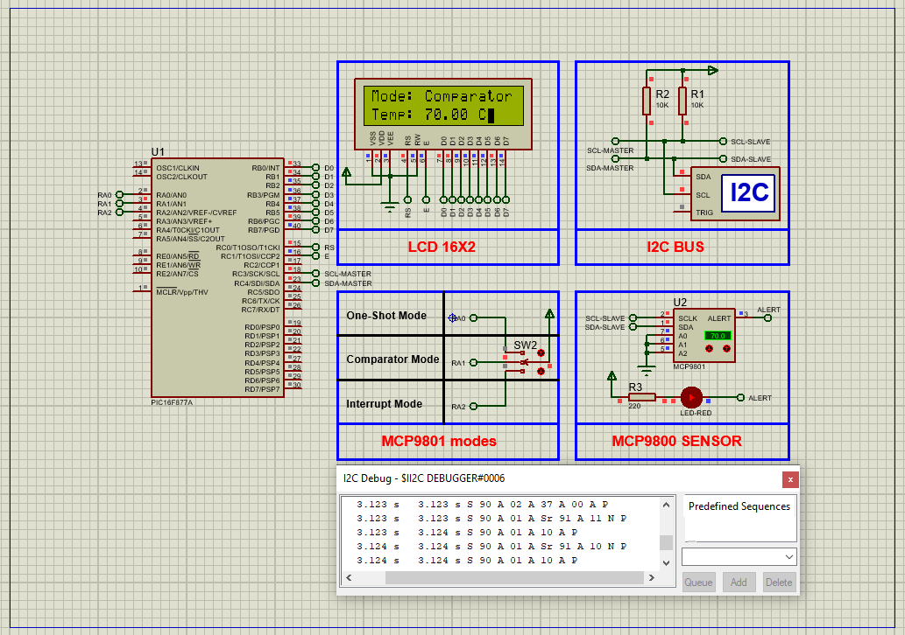

# PIC16F877A Digital Temperature Monitoring using MCP9801 Sensor

This embedded project demonstrates **I2C-based temperature sensing** using a **PIC16F877A microcontroller** connected to a **MCP9801 high-precision digital temperature sensor**. Temperature values are acquired digitally and displayed on a **16x2 LCD**, with support for multiple operational modes including **One-Shot**, **Comparator**, and **Interrupt**. The setup provides high-resolution readings (up to 12-bit) and configurable alert functionality for thermal management.

---

## Hardware Requirements  

- **PIC16F877A Microcontroller**  
- **MCP9801 I2C Digital Temperature Sensor**  
- **16x2 Alphanumeric LCD**  
- **3x Push Buttons** (for mode selection)  
- **Resistors (4.7kΩ for SDA/SCL pull-up + button pull-downs)**  
- **10k Potentiometer** (for LCD contrast)  
- **Power Supply (5V DC)**  
- **Crystal Oscillator (20 MHz)**  
- **Breadboard & Jumper Wires**

---

## Circuit Overview

- **MCP9801 Sensor (I2C Interface)**  
  - **SDA** → Connected to **RC4 (SDA)**  
  - **SCL** → Connected to **RC3 (SCL)**  
  - **Pull-up resistors** (4.7kΩ) on SDA and SCL  
  - **ALERT Pin** → Optional: Connect to any GPIO for interrupts

- **Push Buttons**  
  - RA0: One-Shot Mode  
  - RA1: Comparator Mode  
  - RA2: Interrupt Mode

- **LCD Connections**  
  - **Control Pins**: RS, RW, EN → **RC3, RC4, RC5**  
  - **Data Pins (D4–D7)** → **RD4–RD7**  
  - Contrast control via potentiometer to VEE

---

## Sensor Specifications

### MCP9801 – Digital Temperature Sensor

- **Temperature Range**: -55°C to +125°C  
- **Accuracy**: ±0.5°C at 25°C (typical)  
- **Resolution**: Configurable from **9-bit (0.5°C)** to **12-bit (0.0625°C)**  
- **Interface**: I2C/SMBus (up to 8 devices on one bus)  
- **Low Power**: 200 μA typical, 1 μA in shutdown  
- **Alert Output**: Configurable comparator/interrupt  
- **Voltage Range**: 2.7V to 5.5V

---

## Functional Overview

- **Sensor Initialization**  
  - Configures I2C communication and MCP9801 setup registers  
  - Supports One-Shot and Continuous conversion modes  

- **Mode Handling via Buttons**  
  - **RA0** → One-Shot: Triggers a single conversion  
  - **RA1** → Comparator Mode with hysteresis  
  - **RA2** → Interrupt Mode with different threshold values  

- **Temperature Display on LCD**  
  - Line 1: `Mode: [Current Mode]`  
  - Line 2: `Temp: XX.XX C`  
  - Updated every 2 seconds

---

## Proteus Simulation Configuration

### Components to Select:
- `PIC16F877A`  
- `MCP9801`  
- `LCD 16x2`  
- `3x SWITCH (3P)`  
- `4.7kΩ Resistors` (SDA/SCL + pull-downs)  
- `VCC`, `GND`, `Terminal`, `I2C DEBUGGER` (optional)

### Setup Steps:
1. Open Proteus and create a new project  
2. Add components:
   - **MCP9801**: SDA → RC4, SCL → RC3, add 4.7kΩ pull-ups  
   - **Push Buttons**: RA0, RA1, RA2  
   - **LCD**: RS/RW/EN → RC3/RC4/RC5, D4–D7 → RD4–RD7  
3. Connect 5V and GND to all components  
4. Compile the project in MPLAB/XC8 and load HEX to PIC  
5. Run simulation to see temperature and mode display  

---

## Applications

- **Industrial Temperature Monitoring**  
- **Server Thermal Management**  
- **HVAC and Smart Home Control**  
- **I2C-Based Embedded Projects**  
- **Battery-Powered Devices with One-Shot Mode**

---

## Troubleshooting

| Problem                     | Possible Cause                   | Suggested Solution                    |
|-----------------------------|----------------------------------|----------------------------------------|
| No temperature display      | I2C communication failure        | Check SDA/SCL wiring and pull-ups      |
| Constant or wrong readings  | MCP9801 not initialized          | Ensure `MCP9800_Init()` is called      |
| LCD garbled or off          | Incorrect LCD pins or contrast   | Verify RS/RW/EN and use 10k pot        |
| Buttons unresponsive        | No debounce or wrong logic       | Add delays and check pin configurations|

---

## License  
**MIT License** – Free to use with attribution  
