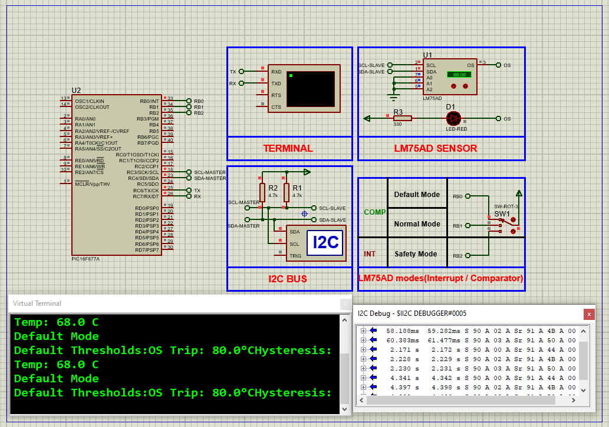

# PIC16F877A Digital Temperature Monitoring using LM75A Sensor (I2C + UART)

This embedded project demonstrates **I2C-based temperature sensing** using a **PIC16F877A microcontroller** and an **LM75A digital temperature sensor**. The measured temperature data is displayed via **UART**, allowing real-time serial monitoring. Multiple operating modes are supported — including **Default**, **Normal**, and **Safety** — each offering customizable thermal protection thresholds.

---

## Hardware Requirements  

- **PIC16F877A Microcontroller**  
- **LM75A I2C Digital Temperature Sensor (LM75AD)**  
- **3x Push Buttons** (for switching modes)  
- **4.7kΩ Resistors** (pull-ups for SDA & SCL, button pull-downs)  
- **UART Terminal or USB-to-Serial Converter (for PC display)**  
- **Power Supply (5V DC)**  
- **Crystal Oscillator (typically 16 MHz)**  
- **Breadboard & Jumper Wires**

---

## Circuit Overview

- **LM75A Sensor**  
  - **SDA** → Connected to **RC4 (SDA)**  
  - **SCL** → Connected to **RC3 (SCL)**  
  - **OS Pin** → Optional alert interrupt (not used in this project)  
  - Pull-up resistors (4.7kΩ) required on SDA and SCL lines  

- **Push Buttons**  
  - RB0: Default Mode  
  - RB1: Normal Mode (Threshold: 60°C)  
  - RB2: Safety Mode (Threshold: 70°C)

- **UART Output**  
  - **TX** → Sent to virtual terminal or PC serial monitor  

---

## Sensor Specifications

### LM75A – Digital Temperature Sensor

- **Resolution**: 11-bit with 0.125°C precision  
- **Temperature Range**: -55°C to +125°C  
- **Accuracy**: ±2°C typical  
- **Interface**: I2C (up to 8 devices on one bus)  
- **Power Supply**: 2.8V to 5.5V  
- **Low Power**: 3.5 μA in shutdown mode  
- **Built-in Alert Output (OS)**  
- **User Programmable**: Overtemperature (Tos), Hysteresis (Thyst), Fault Queue

---

## Functional Overview

- **Sensor Communication via I2C**  
  - Uses bit-banged or hardware I2C routines  
  - Registers accessed include Temp, Config, Thyst, and Tos

- **Real-Time Data Display via UART**  
  - UART displays temperature values in human-readable format  
  - Messages printed every second

- **Operational Modes via Buttons**  
  - **Default Mode**: Reads current factory thresholds  
  - **Normal Mode**: Tos = 60°C, Thyst = 55°C  
  - **Safety Mode**: Tos = 70°C, Thyst = 65°C  

- **Threshold Feedback**  
  - Alert behavior notifies if limits are exceeded (optional expansion)

---

## Proteus Simulation Configuration

### Components to Select:
- `PIC16F877A`  
- `LM75AD`  
- `3x SWITCH (3P)`  
- `Resistors (4.7kΩ)`  
- `UART TERMINAL`  
- `VCC`, `GND`, `I2C DEBUGGER` (optional)

### Setup Steps:
1. Create a new project in Proteus  
2. Place:
   - **LM75AD**: Connect SDA → RC4, SCL → RC3  
   - **3 Buttons**: Connect to RB0, RB1, RB2 with pull-down resistors  
   - **UART Terminal**: Connect TX of PIC to Virtual Terminal  
3. Ensure 5V power and GND lines are connected  
4. Compile your project in MPLAB/XC8 and upload the HEX file  
5. Simulate to observe UART temperature updates and button-based mode switching

---

## Applications

- **Embedded Temperature Monitoring**  
- **System Thermal Protection**  
- **Server/PC Fan Control Logic**  
- **Data Logger Enhancements**  
- **Portable Weather/Environment Sensors**

---

## Troubleshooting

| Problem                   | Possible Cause                      | Suggested Solution                     |
|---------------------------|--------------------------------------|----------------------------------------|
| No UART output            | Incorrect TX pin / baud mismatch     | Confirm TX connection and UART config  |
| Wrong temperature value   | Sensor misread or misconfigured      | Recheck LM75 I2C address & settings    |
| Mode switching fails      | Button not responsive or bouncing    | Add debounce and check logic levels    |
| No sensor communication   | Missing pull-ups on SDA/SCL lines    | Add 4.7kΩ resistors as required        |

---

## License  
**MIT License** – Free to use with attribution  

