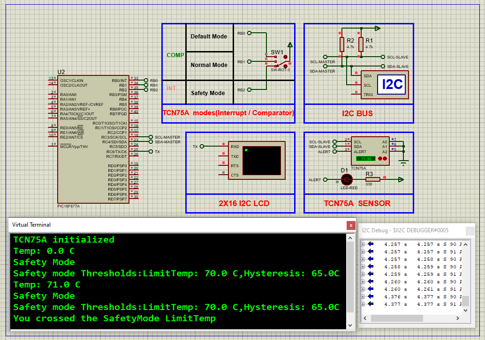

# PIC16F877A Digital Temperature Monitoring using TCN75A Sensor (I2C + UART)

This embedded project demonstrates accurate **temperature monitoring** using a **PIC16F877A microcontroller** and the **TCN75A I2C digital temperature sensor**. The sensor supports programmable thresholds and operational modes, and the measured temperature is displayed via **UART**. With configurable alert modes and fault queue settings, this system ensures robust thermal protection ideal for embedded applications.

---

## Hardware Requirements  

- **PIC16F877A Microcontroller**  
- **TCN75A Digital I2C Temperature Sensor**  
- **3x Push Buttons** (for Mode Switching: Default, Normal, Safety)  
- **Resistors (4.7kΩ)** (for pull-ups on SDA & SCL)  
- **UART Terminal** (PC or virtual terminal)  
- **Power Supply (5V DC)**  
- **16 MHz Crystal Oscillator**  
- **Breadboard & Jumper Wires**

---

## Circuit Overview

- **TCN75A Sensor**  
  - **SDA** → RC4  
  - **SCL** → RC3  
  - Pull-up resistors (4.7kΩ) on SDA and SCL lines  

- **Push Buttons**  
  - RB0: Default Mode  
  - RB1: Normal Mode  
  - RB2: Safety Mode  

- **UART Output**  
  - TX of PIC16F877A connected to Virtual Terminal

---

## Sensor Specifications

### TCN75A – I2C Digital Temperature Sensor

- **Temperature Range**: –40°C to +125°C  
- **Resolution**: Configurable (0.5°C to 0.0625°C)  
- **Accuracy**: ±1°C (typical)  
- **Interface**: I2C (2-wire, up to 8 sensors)  
- **Alert Modes**: Comparator and Interrupt  
- **Power Modes**: Normal, Shutdown, One-Shot  
- **Supply Voltage**: 2.7V to 5.5V  
- **Low Power Consumption**:  
  - Active: 200 µA  
  - Shutdown: 2 µA  

---

## Functional Overview

- **Sensor Communication via I2C**  
  - Read real-time temperature data from the TCN75A  
  - Configure thresholds, fault queue, alert mode, resolution  

- **User Interaction via Buttons**  
  - **RB0**: Default thresholds  
  - **RB1**: Normal operation (60°C / 55°C)  
  - **RB2**: Safety mode (70°C / 65°C)  

- **Real-Time Data via UART**  
  - Displays temperature data and warnings  
  - Alerts when temperature exceeds set thresholds

---

## Operational Modes

| Mode         | Limit Temp | Hysteresis | Alert Mode | Description                        |
|--------------|------------|------------|------------|------------------------------------|
| Default      | Factory set| Factory set| N/A        | Reads and checks default settings  |
| Normal Mode  | 60°C       | 55°C       | Comparator | Standard operation range           |
| Safety Mode  | 70°C       | 65°C       | Interrupt  | High-temperature warning mode      |

---

## Proteus Simulation Configuration

### Components to Use:
- `PIC16F877A`  
- `TCN75A`  
- `3x SWITCH (3P)`  
- `4.7kΩ Resistors`  
- `UART TERMINAL`  
- `I2C DEBUGGER` (optional)  
- `VCC`, `GND`, and power sources  

### Setup Steps:
1. Open Proteus and create a new project  
2. Place:
   - **TCN75A** connected to RC3 (SCL) and RC4 (SDA) with 4.7kΩ pull-ups  
   - Push buttons on RB0, RB1, RB2 (active HIGH with pull-down)  
   - Virtual Terminal connected to TX pin of PIC  
3. Connect all VCC/GND lines  
4. Compile the code and load the HEX file  
5. Run the simulation to observe UART output and switch between modes

---

## Applications

- **Thermal Monitoring in Electronics**  
- **Industrial Equipment Protection**  
- **Server Room Temperature Logging**  
- **Smart HVAC Control**  
- **Fan or Relay Triggering Based on Temperature**

---

## Troubleshooting

| Problem                   | Possible Cause                     | Suggested Fix                            |
|---------------------------|-------------------------------------|------------------------------------------|
| No UART output            | TX pin misconfigured                | Confirm TX line and UART setup           |
| Incorrect temperature     | Wrong resolution or config bits     | Reinitialize sensor and verify registers |
| Mode buttons unresponsive | No debounce or wrong logic levels   | Check pull-down resistors & logic levels |
| Sensor not responding     | SDA/SCL pull-ups missing            | Add 4.7kΩ resistors                      |

---

## License  
**MIT License** – Free to use with attribution  
