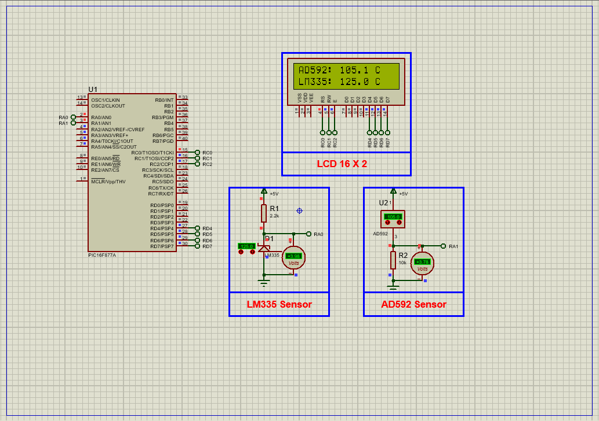

# PIC16F877A Temperature Monitoring using LM335 & AD592 Sensors with LCD Display

This embedded project demonstrates accurate **temperature monitoring** using a **PIC16F877A microcontroller** interfaced with **LM335** and **AD592 analog temperature sensors**. Analog temperature signals are read via the PIC’s **ADC module** and displayed on a **16×2 LCD**. This project highlights sensor calibration, ADC conversion, and real-time temperature display for robust embedded applications.

---

## Hardware Requirements  

- **PIC16F877A Microcontroller**  
- **LM335 Analog Temperature Sensor**  
- **AD592 Analog Temperature Sensor**  
- **16×2 LCD Display**  
- **Potentiometer** (for LM335 calibration)  
- **Resistors and Capacitors** (as needed)  
- **Power Supply (5V DC)**  
- **Breadboard & Jumper Wires**

---

## Circuit Overview

- **LM335 Sensor**  
  - Output connected to **AN0 (RA0)**  
  - Calibration potentiometer connected to ADJ pin  

- **AD592 Sensor**  
  - Output connected to **AN1 (RA1)**  

- **16×2 LCD Display**  
  - Control pins connected to **RC0 (RS), RC1 (RW), RC2 (EN)**  
  - Data pins connected to **PORTD (RD0–RD7)**  

- **Power & Ground**  
  - 5V DC supplied to PIC and sensors  

---

## Sensor Specifications

### LM335 – Precision Analog Temperature Sensor

- Output voltage proportional to absolute temperature (10 mV/K)  
- Operating range: –40°C to 100°C  
- Accuracy: ±1°C (uncalibrated)  
- Calibration possible via adjustment pin  
- Low dynamic impedance (<1 Ω)  

### AD592 – Analog Temperature Transducer

- Output current proportional to absolute temperature (1 µA/K)  
- Operating range: –25°C to +105°C  
- High accuracy: ±0.5°C at 25°C  
- High linearity (±0.15°C max between 0°C to 70°C)  
- Robust against noise and voltage drops  

---

## Functional Overview

- **Analog Temperature Sensing**  
  - LM335 output read on ADC channel 0  
  - AD592 output read on ADC channel 1  

- **Signal Processing**  
  - Conversion of ADC values to Celsius temperatures  
  - Calibration applied for accuracy  

- **Real-Time LCD Display**  
  - First LCD row shows AD592 temperature  
  - Second LCD row shows LM335 temperature  
  - Display refresh every 2 seconds  

---

## Operational Modes

| Mode             | ADC Channels Used    | Display Output             | Description                     |
|------------------|---------------------|----------------------------|--------------------------------|
| Normal Operation  | AN0 (LM335), AN1 (AD592) | Temperatures on LCD rows   | Continuous temperature monitoring |

---

## Proteus Simulation Configuration

### Components to Use:

- `PIC16F877A`  
- `LM335`  
- `AD592`  
- `16×2 LCD`  
- `Potentiometer` (for LM335 calibration)  
- Power supply and ground connections  

### Setup Steps:

1. Open Proteus and create a new project  
2. Add components:  
   - LM335 connected to AN0 (RA0)  
   - AD592 connected to AN1 (RA1)  
   - 16×2 LCD connected to PORTD and PORTC control pins  
   - Potentiometer connected to LM335 ADJ pin for calibration  
3. Connect all VCC and GND lines properly  
4. Compile PIC16F877A code and load the HEX file into the microcontroller  
5. Run the simulation and observe temperature readings on the LCD  

---

## Applications

- Industrial temperature monitoring  
- HVAC system temperature control  
- Battery and power system management  
- Embedded systems education and prototyping  
- Environmental data logging  

---

## Troubleshooting

| Problem                  | Possible Cause                 | Suggested Fix                          |
|--------------------------|-------------------------------|--------------------------------------|
| LCD shows no data        | Incorrect LCD wiring           | Verify LCD connections and pins      |
| Temperature readings off | ADC calibration error          | Recalibrate LM335 using potentiometer|
| Unstable readings       | Electrical noise or poor power | Add decoupling capacitors, check power supply |
| No ADC readings         | ADC module misconfigured       | Confirm ADC initialization and channel selection |

---

## License  
**MIT License** – Free to use with attribution

