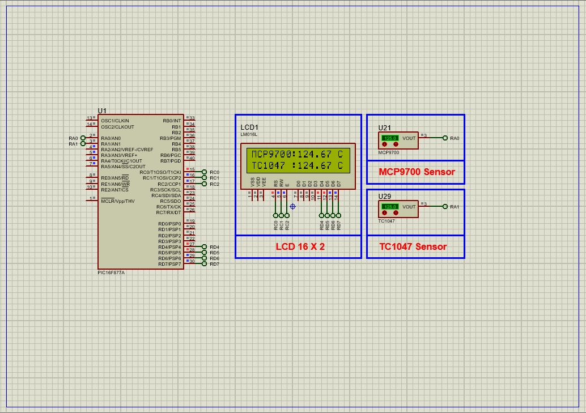

# PIC16F877A Temperature Monitoring using TC1047 & MCP9700 Analog Sensors with LCD Display

This embedded project demonstrates accurate **temperature monitoring** using a **PIC16F877A microcontroller** and the **TC1047 and MCP9700 low-power analog temperature sensors**. The PIC reads analog signals from the sensors via its ADC module, processes the data, and displays the temperature on a **16×2 LCD**. With ultra-low power consumption sensors and real-time display, this system is ideal for embedded environmental monitoring applications.

---

## Hardware Requirements  

- **PIC16F877A Microcontroller**  
- **TC1047 Analog Temperature Sensor**  
- **MCP9700 Analog Temperature Sensor**  
- **16×2 LCD Display**  
- **Power Supply (3.3V - 5V DC)**  
- **Breadboard & Jumper Wires**

---

## Circuit Overview

- **TC1047 Sensor**  
  - Output connected to **AN1 (RA1)** of PIC16F877A  
- **MCP9700 Sensor**  
  - Output connected to **AN0 (RA0)** of PIC16F877A  
- **16×2 LCD Display**  
  - Control Pins:  
    - RS → RC0  
    - RW → RC1  
    - EN → RC2  
  - Data Pins → PORTD  
- **Power Supply & Ground** connected appropriately to sensors and PIC  

---

## Sensor Specifications

### TC1047 – Analog Temperature Sensor

- **Temperature Range**: –40°C to +125°C  
- **Output**: Linear voltage, 10 mV/°C  
- **Supply Voltage**: 2.7V to 5.5V  
- **Current Consumption**: 35 µA typical  
- **Package**: SOT-23B 3-pin  
- **Applications**: Portable electronics, thermal management, industrial instrumentation  

### MCP9700 – Analog Temperature Sensor

- **Temperature Range**: –40°C to +150°C  
- **Output**: Linear voltage, 10 mV/°C  
- **Supply Voltage**: 2.3V to 5.5V  
- **Current Consumption**: 6 µA typical  
- **Package**: SOT-23, TO-92  
- **Applications**: Environmental monitoring, home appliances, general-purpose sensing  

---

## Functional Overview

- **Analog Temperature Sensing via ADC**  
  - Read sensor voltages on AN0 (MCP9700) and AN1 (TC1047)  
  - Convert ADC values to temperature based on sensor characteristics  
- **LCD Display**  
  - Real-time temperature display on a 16×2 LCD  
- **Low Power Consumption**  
  - Suitable for battery-powered embedded applications  

---

## Operational Details

| Sensor   | Input Channel | Temp. Range       | Output Scale   | Current Consumption | Description                         |
|----------|---------------|-------------------|----------------|---------------------|-----------------------------------|
| MCP9700 | AN0 (RA0)     | –40°C to +150°C   | 10 mV / °C     | 6 µA                | Low power linear active thermistor |
| TC1047   | AN1 (RA1)     | –40°C to +125°C   | 10 mV / °C     | 35 µA               | Precision temperature-to-voltage sensor |

---

## Proteus Simulation Configuration

### Components to Use:
- `PIC16F877A`  
- `16×2 LCD Display`  
- `MCP9700 Sensor`  
- `TC1047 Sensor`  
- `VCC`, `GND`, and power sources  

### Setup Steps:
1. Open Proteus and create a new project  
2. Place the sensors on AN0 and AN1 respectively  
3. Connect the LCD pins as per circuit overview (RC0, RC1, RC2 for control; PORTD for data)  
4. Connect power supply and ground  
5. Compile and load the HEX file for the PIC16F877A  
6. Run the simulation and observe temperature updates on the LCD  

---

## Applications

- Ambient temperature monitoring in embedded systems  
- Portable battery-operated devices  
- Environmental and industrial temperature sensing  
- Consumer electronics thermal management  

---

## Troubleshooting

| Problem                     | Possible Cause                      | Suggested Fix                             |
|-----------------------------|------------------------------------|-------------------------------------------|
| No display on LCD           | LCD wiring or initialization issue | Verify LCD connections and initialization |
| Incorrect temperature values | ADC reference voltage or scaling   | Check ADC configuration and calibration   |
| No ADC reading             | Sensor wiring or channel misconfigured | Verify sensor connections and ADC channel selection |
| Unstable readings          | Noise or power supply issues         | Add decoupling capacitors, verify power   |

---

## License  
**MIT License** – Free to use with attribution  
