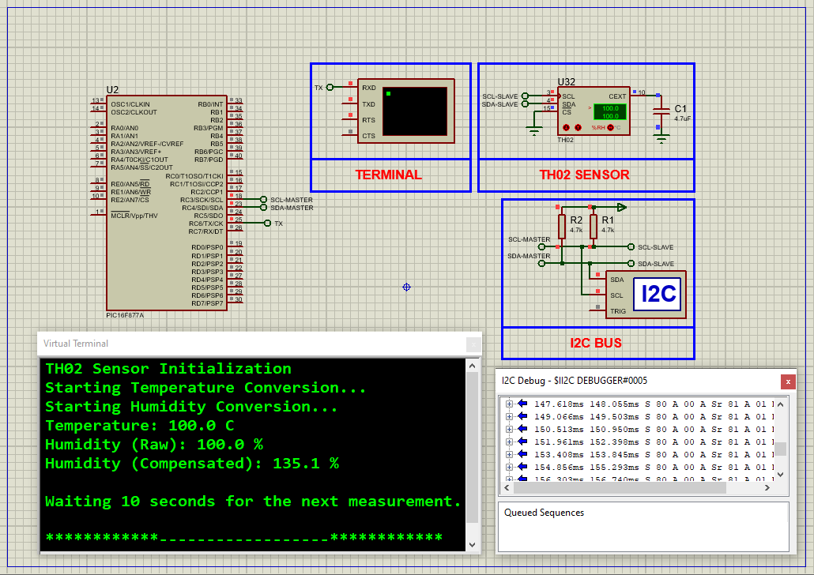

# PIC16F877A Temperature & Humidity Monitoring Using TH02 I2C Sensor with UART Output

This embedded project demonstrates accurate **temperature and humidity monitoring** using the **PIC16F877A microcontroller** interfaced with the **TH02 digital temperature & humidity sensor** via **I2C**. The microcontroller continuously reads, compensates, and outputs real-time environmental data through **UART** communication, making it ideal for precise embedded monitoring applications.

---

## Hardware Requirements

- **PIC16F877A Microcontroller**  
- **TH02 I2C Temperature & Humidity Sensor**  
- **UART Terminal (PC or Virtual Terminal)**  
- **Power Supply (3.3V - 5V DC)**  
- **Pull-up Resistors (4.7 kΩ) for I2C Lines**  
- **Breadboard & Jumper Wires**

---

## Circuit Overview

- **TH02 Sensor**  
  - SDA → RC4 (SDA)  
  - SCL → RC3 (SCL)  
- **UART TX** → RC6 (TX pin)  
- Power and Ground connected appropriately  
- Pull-up resistors on SDA and SCL lines  

---

## Sensor Specifications

### TH02 – Digital Temperature & Humidity Sensor

- **Temperature Range:** –40°C to +85°C  
- **Humidity Range:** 0% to 100% RH  
- **Temperature Accuracy:** ±0.5°C  
- **Humidity Accuracy:** ±4.5% RH  
- **Interface:** I2C (up to 400 kHz)  
- **Power Consumption:** Low power  
- **Integrated Heater:** Yes (for condensation management)  
- **Package:** 4×4 mm QFN  

---

## Functional Overview

- **I2C Master Communication** on PIC16F877A to interface with TH02 sensor  
- **Temperature and Humidity Measurement** with factory-calibrated compensation  
- **UART Communication** to output sensor readings to terminal  
- **Real-Time Environmental Monitoring** suitable for embedded systems  

---

## Operational Details

| Parameter         | Description                   |
|-------------------|------------------------------|
| I2C Address       | 0x40 (7-bit)                 |
| Temperature Range | –40°C to +85°C               |
| Humidity Range    | 0% to 100% RH                |
| UART Baud Rate    | 9600 bps (default)           |
| I2C Bus Speed     | 100 kHz (standard mode)      |
| Output Format     | Temperature (°C) & Humidity (%) |

---

## Proteus Simulation Configuration

### Components Used:
- `PIC16F877A`  
- `TH02 I2C Temperature & Humidity Sensor`  
- `UART Virtual Terminal`  
- `Pull-up Resistors (4.7kΩ)`  
- `Power Supply and Ground`

### Setup Steps:
1. Open Proteus and create a new project.  
2. Add PIC16F877A and TH02 sensor modules.  
3. Connect SDA (TH02) to RC4 and SCL (TH02) to RC3 of PIC16F877A.  
4. Add pull-up resistors (4.7kΩ) to SDA and SCL lines.  
5. Connect UART TX (RC6) to the UART terminal RX.  
6. Connect power and ground to all components.  
7. Compile and upload the HEX file to the PIC16F877A.  
8. Run the simulation and monitor temperature and humidity data on UART terminal.

---

## Applications

- HVAC and climate control systems  
- Automotive cabin environment monitoring  
- Industrial humidity and temperature regulation  
- Portable weather stations and smart home devices  
- Battery-powered embedded sensor nodes  

---

## Troubleshooting

| Issue                  | Possible Cause                       | Recommended Solution                     |
|------------------------|------------------------------------|----------------------------------------|
| No UART Output         | UART not initialized or miswired   | Check UART initialization and wiring   |
| I2C Communication Fail | Incorrect SDA/SCL wiring or missing pull-ups | Verify wiring and add pull-up resistors |
| Incorrect Sensor Data  | Sensor busy or improperly powered  | Allow sensor stabilization and check power supply |
| Unstable Readings      | Noise or timing issues              | Add delays, verify clock frequency and power stability |

---

## License

**MIT License** – Free to use with attribution
