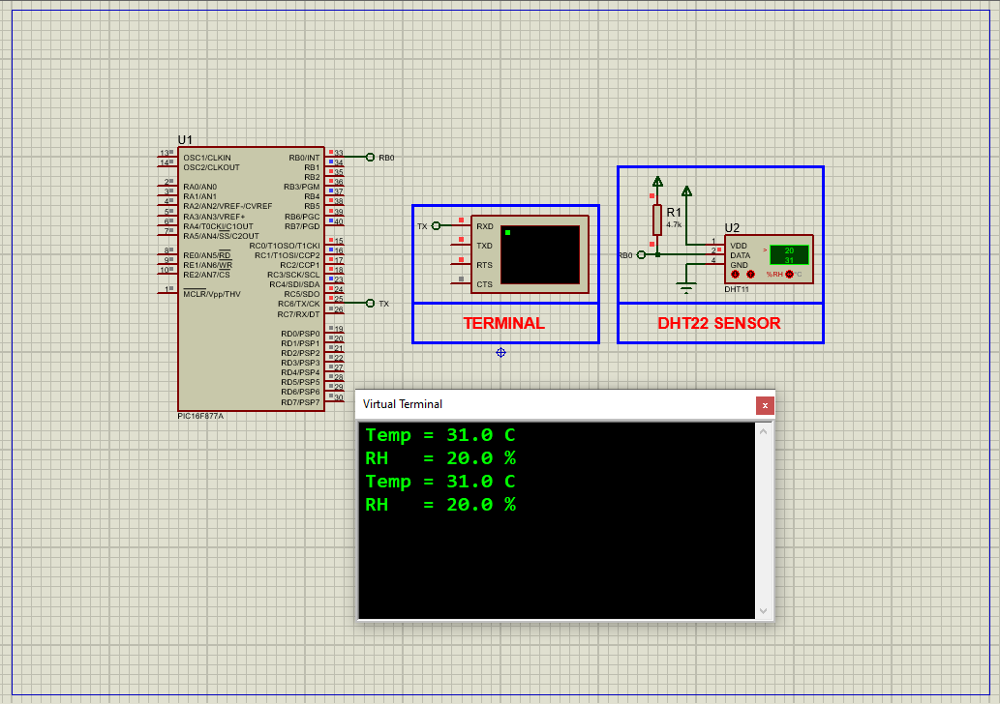

# PIC16F877A Temperature and Humidity Monitoring Using DHT11 Sensor

This embedded project demonstrates interfacing the **DHT11 temperature and humidity sensor** with a **PIC16F877A microcontroller**. The microcontroller reads digital temperature and relative humidity data from the DHT11 sensor using precise timing and single-wire communication, then transmits the readings via UART for monitoring.

---

## Hardware Requirements

- **PIC16F877A Microcontroller**  
- **DHT11 Temperature and Humidity Sensor**  
- **UART to USB Converter** or Serial Terminal  
- **Resistors** (pull-ups and signal conditioning)  
- **100nF Capacitor** (for sensor power stability)  
- **Power Supply (5V DC)**  
- **8 MHz Crystal Oscillator**  
- **Breadboard & Jumper Wires**

---

## Circuit Overview

- **DHT11 Sensor**  
  - Single data pin connected to **RB0** of PIC16F877A  
  - Power (VCC) connected to 5V with a 100nF decoupling capacitor to GND  
  - Data line uses single-wire open-drain signaling requiring software timing

- **PIC16F877A**  
  - RB0 configured as bidirectional pin for sensor data  
  - RC6 configured as UART TX pin for serial data output  
  - 8 MHz crystal oscillator for timing accuracy

---

## Sensor Specifications

### DHT11 – Temperature & Humidity Sensor

- **Temperature Range:** 0°C to 50°C  
- **Humidity Range:** 20% to 90% RH  
- **Accuracy:** ±2°C (temperature), ±5% RH (humidity)  
- **Output:** Single-wire 40-bit digital signal  
- **Operating Voltage:** 3V to 5.5V  
- **Sampling Rate:** Up to 1 reading per second  
- **Calibration:** Internal OTP memory calibration

---

## Functional Overview

- **Start Signal:**  
  The microcontroller pulls the sensor data line low for at least 18 ms to initiate communication.

- **Sensor Response:**  
  The sensor acknowledges by pulling the line low and then high with precise timing pulses.

- **Data Transmission:**  
  Sensor transmits 40 bits:  
  - 8 bits humidity integer  
  - 8 bits humidity decimal  
  - 8 bits temperature integer  
  - 8 bits temperature decimal  
  - 8 bits checksum

- **Data Reading & Validation:**  
  Pulse width measured using Timer1 to determine bit values. Checksum verified for data integrity.

- **UART Output:**  
  Formatted temperature and humidity values are sent continuously every second for monitoring.

---

## Software Highlights

- Utilizes **Timer1** for pulse timing measurement  
- Bitwise assembly of 40-bit data packet  
- Checksum verification for error detection  
- UART configured at 9600 baud for serial communication  
- Continuous reading and data transmission every second

---

## Proteus Simulation Configuration

### Components to Select

- `PIC16F877A`  
- `DHT11 Temperature & Humidity Sensor`  
- `Resistors` (pull-ups and sensor stabilization)  
- `Terminal` for UART serial output  
- `Power Supply` (5V DC)  
- `8 MHz Crystal Oscillator`

### Setup Steps

1. Create a new project in Proteus.  
2. Place the PIC16F877A microcontroller and configure the oscillator and power pins.  
3. Connect the DHT11 data pin to **RB0**, add 100nF capacitor across sensor power pins.  
4. Add a UART terminal connected to **RC6** (TX pin).  
5. Load the compiled HEX file into the PIC microcontroller.  
6. Run the simulation and observe temperature and humidity data output on the UART terminal.

---

## Applications

- Indoor environmental monitoring  
- HVAC systems  
- Greenhouse automation  
- Weather stations  
- IoT sensor networks

---

## Troubleshooting

| Problem                  | Possible Cause                  | Suggested Solution                      |
|--------------------------|--------------------------------|----------------------------------------|
| No data from sensor      | Sensor not powered or wired incorrectly | Verify wiring and power supply          |
| Incorrect readings       | Timing misconfiguration         | Check Timer1 setup and delays           |
| UART output garbled      | Baud rate mismatch or wiring    | Confirm UART baud rate and connections  |
| Checksum errors          | Noise or unstable signal        | Add decoupling capacitor, check wiring  |

---

## License

**MIT License** – Free to use with attribution.

