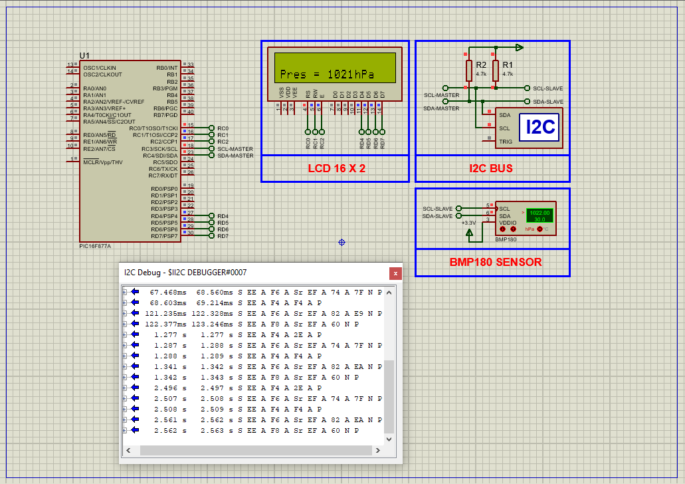

# PIC16F877A Temperature and Pressure Monitoring Using BMP180 Sensor

This embedded project demonstrates interfacing the **BMP180 digital barometric pressure and temperature sensor** with a **PIC16F877A microcontroller**. The microcontroller reads calibrated temperature and atmospheric pressure data via the I2C interface and displays the output on a 16x2 LCD in real time.

---

## Hardware Requirements

- **PIC16F877A Microcontroller**  
- **BMP180 Temperature and Pressure Sensor**  
- **16x2 LCD Display**  
- **4.7kΩ Resistors** (I2C pull-ups)  
- **100nF Capacitor** (for sensor power stability)  
- **Power Supply (5V DC)**  
- **16 MHz Crystal Oscillator**  
- **Breadboard & Jumper Wires**

---

## Circuit Overview

- **BMP180 Sensor**  
  - SDA connected to **RC4 (SDA)** of PIC16F877A  
  - SCL connected to **RC3 (SCL)**  
  - 4.7kΩ pull-up resistors on SDA and SCL lines  
  - Powered by 5V with 100nF decoupling capacitor to GND

- **PIC16F877A**  
  - I2C communication via **MSSP module (RC3/RC4)**  
  - LCD connected in 4-bit mode to **RD4–RD7** for data and **RC0–RC2** for control  
  - 16 MHz crystal oscillator for system timing

---

## Sensor Specifications

### BMP180 – Temperature & Pressure Sensor

- **Temperature Range:** 0°C to +65°C  
- **Pressure Range:** 300 hPa to 1100 hPa  
- **Accuracy:** ±0.5°C (temperature), ±1 hPa (pressure typical)  
- **Interface:** I2C (7-bit address: `0x77`)  
- **Operating Voltage:** 1.8V to 3.6V (5V tolerant via onboard regulator)  
- **Output:** 16 to 19-bit compensated digital values  
- **EEPROM:** Factory-stored calibration coefficients  
- **Sampling Modes:** Ultra-low power, standard, high-res, ultra high-res

---

## Functional Overview

- **Sensor Initialization:**  
  Reads EEPROM-stored calibration data during system startup.

- **Measurement Sequence:**  
  - Initiates temperature and pressure measurements over I2C  
  - Waits for conversion completion  
  - Reads uncompensated temperature and pressure values

- **Compensation Algorithm:**  
  Applies Bosch-recommended formulas using calibration constants to compute true temperature and pressure.

- **LCD Display:**  
  Displays real-time temperature in **°C** and pressure in **hPa** updated every 500 ms.

---

## Software Highlights

- I2C communication using **MSSP module**  
- EEPROM calibration data acquisition  
- Bosch’s compensation formula for temperature and pressure  
- 16x2 LCD interfaced in **4-bit mode**  
- Measurement loop repeated every half second

---

## Proteus Simulation Configuration

### Components to Select

- `PIC16F877A`  
- `BMP180 Sensor Module`  
- `16x2 LCD Display`  
- `Resistors` (4.7kΩ for SDA and SCL pull-ups)  
- `100nF Capacitor`  
- `Power Source` (5V DC)  
- `16 MHz Crystal Oscillator`

### Setup Steps

1. Create a new Proteus project.  
2. Place the PIC16F877A and configure power and oscillator connections.  
3. Connect BMP180 sensor: SDA to **RC4**, SCL to **RC3**, with pull-up resistors.  
4. Add the 16x2 LCD in 4-bit mode: data lines to **RD4–RD7**, control to **RC0–RC2**.  
5. Load the compiled `.hex` file into the PIC.  
6. Run simulation to observe live temperature and pressure readings.

---

## Applications

- Indoor weather monitoring  
- Altitude estimation  
- HVAC system integration  
- IoT environmental nodes  
- Educational and learning kits

---

## Troubleshooting

| Problem                   | Possible Cause                          | Suggested Solution                              |
|---------------------------|------------------------------------------|--------------------------------------------------|
| No LCD display            | Incorrect wiring or power issue          | Recheck LCD wiring and power connections         |
| BMP180 not responding     | I2C address mismatch or missing pull-ups | Confirm address `0x77` and add 4.7kΩ resistors   |
| Incorrect readings        | Missing calibration or bad algorithm     | Ensure EEPROM values are read and used properly |
| LCD frozen or flickering  | Delays too short or noise on VCC         | Add delay and 100nF decoupling capacitor         |
| Simulation won’t start    | Hex file missing or MCU not configured   | Reload hex file and check oscillator setup       |

---

## License

**MIT License** – Free to use with attribution.
