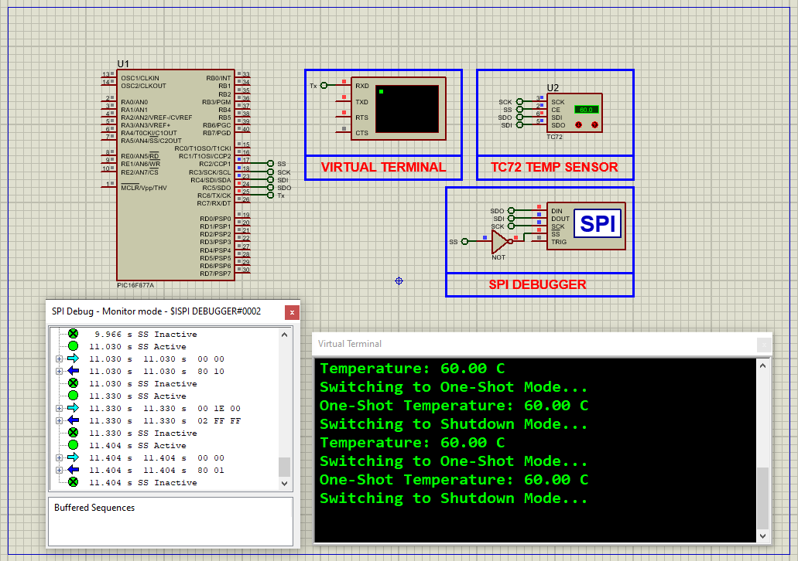

# PIC16F877A Digital Temperature Monitoring Using TC72 Sensor (SPI)

This embedded project demonstrates how to interface the **TC72 digital temperature sensor** with a **PIC16F877A microcontroller** using the **SPI protocol**. The system reads accurate temperature values and sends them to a UART-based terminal for real-time monitoring. The project also showcases low-power operation using One-Shot and Shutdown modes.

---

## Hardware Requirements

- **PIC16F877A Microcontroller**
- **TC72 Digital Temperature Sensor**
- **16 MHz Crystal Oscillator**
- **UART Virtual Terminal** (e.g., Proteus Serial Terminal)
- **Power Supply (5V DC)**
- **Breadboard and Jumper Wires**

---

## Circuit Overview

### TC72 Sensor Connection
- **SCLK (Clock)** → RC3
- **SDI (MISO)** → RC4
- **SDO (MOSI)** → RC5
- **CS (Chip Select)** → RC2
- **Vcc** → +5V
- **GND** → GND

### PIC16F877A Configuration
- SPI communication via **MSSP module (RC3–RC5)**
- UART transmission via **RC6 (TX)**
- **16 MHz crystal** for accurate timing

---

## Sensor Specifications

### TC72 – Digital Temperature Sensor

- *Temperature Range:* -55°C to +125°C  
- *Accuracy:* ±2°C (-40°C to +85°C), ±3°C full range  
- *Resolution:* 10-bit (0.25°C per LSB)  
- *Interface:* SPI compatible  
- *Operating Voltage:* 2.65V to 5.5V  
- *Power Consumption:*  
  - 250 µA in Continuous Conversion Mode  
  - 1 µA in Shutdown Mode  
- *Modes Supported:*  
  - Continuous Conversion  
  - One-Shot  
  - Shutdown

---

## Functional Overview

- *Sensor Initialization:*  
  TC72 is powered on and set to **Continuous Mode** for periodic temperature updates.

- *Measurement Cycle:*  
  - Reads MSB and LSB from sensor via SPI
  - Converts raw data to floating-point Celsius value
  - Displays result on UART terminal

- *Power-Saving Demonstration:*  
  - Switches to **One-Shot Mode** for isolated readings  
  - Moves to **Shutdown Mode** between cycles to reduce consumption

- *Manufacturer ID Check:*  
  Reads and verifies ID (0x54) to ensure proper communication

---

## Software Highlights

- SPI Master configuration using **MSSP module**
- UART initialization and transmission for serial output
- Sensor register access (CONTROL, TEMP MSB/LSB, MANUFACTURER ID)
- Power mode toggling via SPI commands
- Data formatting with `sprintf()` for UART-friendly output

---

## Proteus Simulation Configuration

### Required Components

- `PIC16F877A`
- `TC72 SPI Digital Temperature Sensor`
- `Virtual Terminal` (Proteus instrument)
- `16 MHz Crystal Oscillator`
- `Power Supply (5V DC)`
- `Ground and NOT gates` (if needed for logic inversion)

### Setup Instructions

1. Open Proteus and create a new project.
2. Place and wire the **PIC16F877A** with its 16 MHz oscillator.
3. Add the **TC72 sensor** and connect SPI pins (RC3–RC5, RC2).
4. Add a **Virtual Terminal**, connect TX to **RC6**.
5. Connect VCC and GND to all components as needed.
6. Load the compiled `.hex` file into the PIC.
7. Run the simulation to view live temperature readings and mode transitions.

---

## Applications

- Industrial and consumer temperature monitoring
- Smart electronics with thermal protection
- Battery-powered remote sensing nodes
- Teaching tool for SPI protocol and power modes
- Home and lab environmental sensing systems

---

## Troubleshooting

| Issue                        | Likely Cause                          | Solution                                         |
|-----------------------------|----------------------------------------|--------------------------------------------------|
| No UART output              | UART misconfigured                     | Confirm TX pin and baud rate setup              |
| TC72 not detected           | SPI lines miswired or no response      | Verify CS/SPI wiring and sensor power           |
| Incorrect temperature       | Bit-shift error or LSB miscalculation  | Check conversion logic for MSB/LSB handling     |
| High current draw           | Sensor stuck in Continuous Mode        | Switch to Shutdown or One-Shot modes            |
| Simulation won’t start      | Missing hex file or clock issue        | Reload hex and verify 16 MHz crystal connections|

---

## License

**MIT License**  
This project is open-source and free to use for educational or commercial purposes with proper attribution.
