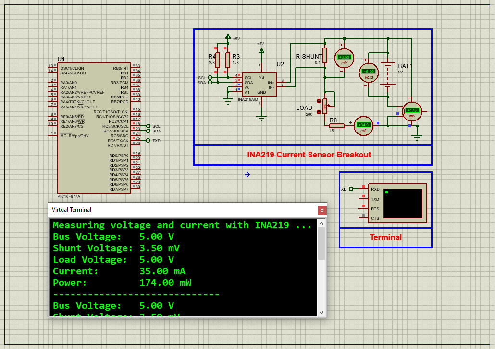

# PIC16F877A Energy Monitoring Using INA219AID Current Sensor (I²C)

This project demonstrates how to interface the **INA219AID current sensor** with the **PIC16F877A microcontroller** to build a precise energy monitoring system for power measurement and analysis. The system measures voltage, current, and power in real-time and sends the data via UART for monitoring.

---

## INA219AID Features and Applications

### Key Features

- **Wide Voltage Range:** Measures bus voltages from 0 to 26 V, suitable for low to medium voltage systems.  
- **High Accuracy:** Maximum error of 0.5% over temperature for reliable measurements.  
- **Programmable Calibration:** Allows improved accuracy and flexibility.  
- **I²C Interface:** Supports 16 programmable addresses for multi-device systems.  
- **Compact Packages:** Available in SOT23-8 and SOIC-8 for space-constrained designs.  
- **Power Management:** Ideal for servers, telecom, and power supplies.  
- **Battery Monitoring:** Tracks charge/discharge cycles in battery-powered devices.  
- **Test Equipment:** Provides accurate measurements for debugging and validation.  
- **Industrial Automation:** Efficient energy monitoring in welding and industrial equipment.

### Functional Highlights

- Measures **shunt voltage** (voltage drop across a low-value resistor) proportional to current.  
- Measures **bus voltage** (supply voltage relative to ground) up to 26 V.  
- Combines measurements to calculate **real-time power consumption** internally.  
- Supports **adjustable gain** for shunt voltage ranging ±40 mV to ±320 mV.  
- Operates reliably in a wide temperature range (-40°C to 125°C).  
- Provides overvoltage protection and robust thermal/electrical safeguards.

---

## Project Overview: Interfacing INA219 with PIC16F877A

This project interfaces the INA219 current sensor with a PIC16F877A microcontroller to measure voltage, current, and power. Sensor data is transmitted via UART for real-time monitoring and debugging.

### System Features

- UART communication to display sensor data (bus voltage, shunt voltage, current, power).  
- I²C communication with INA219 for sensor control and data acquisition.  
- Accurate real-time energy monitoring with calibration and power-saving options.  

---

## Hardware Requirements

- **PIC16F877A Microcontroller**  
- **INA219AID Current Sensor**  
- **16 MHz Crystal Oscillator**  
- **UART Virtual Terminal** (e.g., Proteus Serial Terminal)  
- **Power Supply (5V DC)**  
- **Breadboard, Jumper Wires, Resistors, Potentiometer**  

---

## Circuit Overview

- Connect **SCL (I2C Clock)** to **RC3**  
- Connect **SDA (I2C Data)** to **RC4**  
- Connect **Vcc** to 5V supply  
- Connect **GND** to ground  
- UART TX pin **RC6** connected to virtual terminal for serial output  
- Include necessary pull-up resistors on I2C lines  

---

## Software Components

- **Main header (main.h):** Defines configuration bits, oscillator frequency, and necessary includes.  
- **UART driver (uart.h):** Handles UART initialization and data transmission/reception.  
- **I2C driver (i2c.h):** Manages I2C start/stop conditions, data read/write operations.  
- **INA219 driver (INA219.h):** Defines INA219 registers, configuration masks, and functions for sensor operations.  
- **Main program (main.c):** Initializes peripherals, reads sensor data, and outputs formatted data via UART.

---

## Functional Flow

- Initialize UART and I2C interfaces.  
- Configure INA219 sensor and calibration registers.  
- Periodically read shunt voltage, bus voltage, current, and power via I2C.  
- Calculate load voltage (bus voltage + shunt voltage).  
- Format and send readings over UART every 2 seconds.  

---

## Proteus Simulation Setup

1. Open Proteus and create a new project.  
2. Add **PIC16F877A**, **INA219AID sensor**, **Potentiometer**, and **Resistor** components.  
3. Connect I2C lines (SCL to RC3, SDA to RC4) and UART TX (RC6) to Virtual Terminal.  
4. Configure power supply and ground connections.  
5. Add Virtual Terminal instrument and configure it for serial monitoring.  
6. Load the compiled hex file into PIC16F877A.  
7. Run simulation to view real-time voltage, current, and power data on terminal.

---

## Applications

- Power consumption monitoring in embedded and industrial systems  
- Battery charge/discharge monitoring in portable electronics  
- Energy-efficient system development  
- Educational tool for learning I2C communication and sensor interfacing  
- Debugging and validation in test equipment setups  

---

## Troubleshooting

| Issue                      | Possible Cause                     | Suggested Solution                             |
|----------------------------|----------------------------------|-----------------------------------------------|
| No UART output             | UART misconfiguration             | Check TX pin and baud rate settings            |
| INA219 sensor not detected | I2C wiring or sensor power issues | Verify I2C connections and power supply        |
| Incorrect sensor readings  | Calibration or register issues    | Review INA219 initialization and calibration  |
| Simulation does not start  | Missing hex or clock problem      | Recheck hex loading and crystal oscillator     |

---

## License

**MIT License**  
This project is open-source and free to use for educational or commercial purposes with proper attribution.

---
