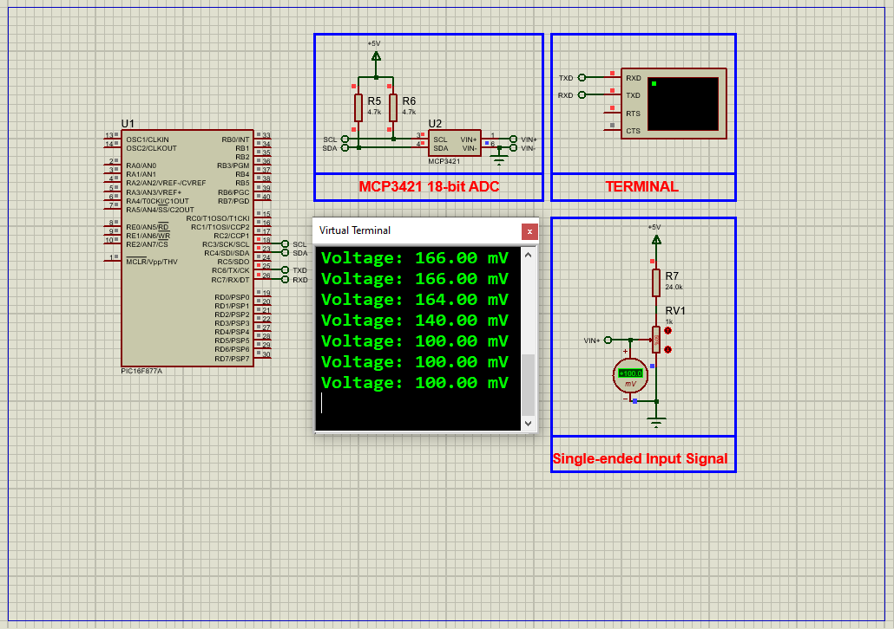

# MCP3421 18-bit ADC Interfacing with PIC16F877A Microcontroller

In this project, we explore interfacing the **MCP3421 18-bit ADC** with the **PIC16F877A microcontroller** to build a high-precision sensor data acquisition system for accurate voltage measurement and analysis.

---

## MCP3421 Overview

The MCP3421 is a high-precision, 18-bit delta-sigma analog-to-digital converter (ADC) designed for applications requiring accurate and reliable analog data conversion. It features a differential input architecture that allows measurement of voltage differences while rejecting common-mode noise. Operating from a single supply voltage (2.7V to 5.5V), it communicates via an I²C interface for easy integration. The device also includes an onboard precision voltage reference and a programmable gain amplifier (PGA) for enhanced flexibility.

---

## MCP3421 Features and Applications

### Key Features

- **High Resolution:** Up to 18 bits of resolution for exceptional accuracy.  
- **Differential Inputs:** Rejects common-mode noise, ideal for noisy environments.  
- **Onboard PGA:** Programmable gain amplifier with gains of 1, 2, 4, or 8 for measuring small signals.  
- **I²C Interface:** Supports standard, fast, and high-speed modes over two-wire bus.  
- **Low Power Consumption:** Suitable for battery-powered applications.  
- **Self-Calibration:** Automatic self-calibration per conversion for consistent accuracy.  

### Typical Applications

- Portable instrumentation requiring precise, low-power measurements.  
- Weigh scales and fuel gauges needing high resolution.  
- Temperature sensing with RTDs, thermistors, thermocouples.  
- Bridge sensing in pressure, strain, and force measurements.  

---

## MCP3421 Block Diagram

- **Programmable Gain Amplifier (PGA):** Amplifies input signal by 1, 2, 4, or 8.  
- **Delta-Sigma ADC:** Converts amplified analog signal to digital (up to 18 bits).  
- **Onboard Reference:** Stable 2.048 V voltage reference.  
- **I²C Interface:** For communication with microcontroller.  
- **Oscillator:** Generates internal clock for ADC conversion.  
- **Configuration Register:** Stores settings like PGA gain, conversion mode, and data rate.  

---

## Project: Interfacing MCP3421 ADC with PIC16F877A for Precision Voltage Measurement

This project uses the MCP3421 ADC with the PIC16F877A to measure voltage with high precision. Communication occurs over I²C, and results are transmitted via UART to a serial monitor in millivolts (mV).

---

## Hardware Requirements

- **PIC16F877A Microcontroller**  
- **MCP3421 18-bit ADC**  
- **16 MHz Crystal Oscillator**  
- **Potentiometer and Resistors** for input signal  
- **UART Virtual Terminal** (e.g., Proteus Serial Terminal)  
- **Power Supply (2.7V to 5.5V)**  

---

## Circuit Overview

- **SCL (I2C Clock)** connected to **RC3** on PIC16F877A  
- **SDA (I2C Data)** connected to **RC4**  
- **Vcc** connected to power supply (2.7V - 5.5V)  
- **GND** connected to ground  
- UART TX pin **RC6** connected to Virtual Terminal for serial output  
- Pull-up resistors on I2C lines for stable communication  

---

## Software Components

### main.h
- Defines PIC configuration bits  
- Sets oscillator frequency (16 MHz)  
- Includes necessary libraries

### uart.h
- Functions to initialize UART and transmit data  
- Handles single byte and string transmission

### i2c.h
- Configures I2C pins and baud rate (100 kHz)  
- Functions for I2C start, stop, read, write, ACK/NACK operations  

### MCP3421.h
- Defines MCP3421 constants and struct for configuration  
- Functions for initialization, data reading, and status checking  

### main.c
- Initializes UART and I2C modules  
- Configures MCP3421 for 16-bit resolution and PGA x1  
- Reads ADC values when ready  
- Converts raw data to voltage (mV)  
- Sends formatted voltage data over UART every second  

---

## Functional Flow

1. Initialize UART and I2C peripherals.  
2. Initialize MCP3421 with I2C address, resolution, and gain.  
3. Continuously check if MCP3421 is ready for a new conversion.  
4. Read ADC data and convert to voltage in millivolts.  
5. Format voltage as string and transmit via UART.  
6. Delay 1 second before next reading.  

---

## Proteus Simulation Setup

1. Open Proteus and create a new project.  
2. Add **PIC16F877A**, **MCP3421 ADC**, **Potentiometer**, and **Resistor** components.  
3. Connect **SCL** to **RC3**, **SDA** to **RC4** on PIC16F877A.  
4. Connect UART **TX (RC6)** to a Virtual Terminal.  
5. Provide power and ground connections correctly.  
6. Load the compiled hex file into PIC16F877A.  
7. Run simulation and observe real-time voltage readings on the terminal.  

---

## Troubleshooting

| Issue                    | Possible Cause                  | Suggested Solution                         |
|--------------------------|--------------------------------|--------------------------------------------|
| No UART output           | UART misconfiguration           | Check TX pin and baud rate settings         |
| MCP3421 not detected     | I2C wiring or power issues      | Verify I2C connections, pull-ups, power    |
| Incorrect voltage values | Wrong ADC config or scaling     | Review MCP3421 init and conversion formula |
| Simulation fails to start| Missing hex or oscillator issues| Ensure hex loaded and oscillator configured|

---

## License

**MIT License**  
This project is open-source and free to use with attribution for educational or commercial purposes.

---
