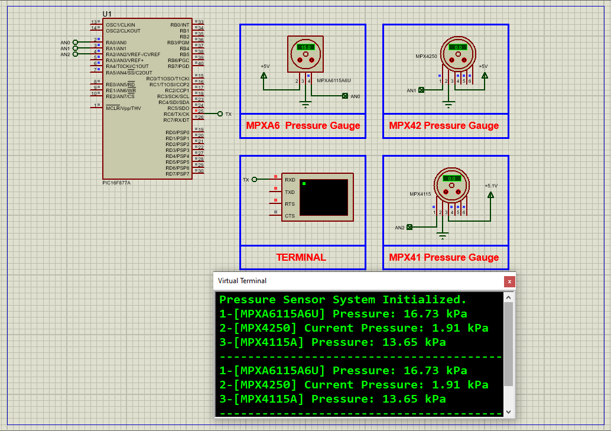

# Pressure Measurement System Using MPX4250A, MPX4115, MPXA6115A Sensors with PIC16F877A Microcontroller

In this project, we explore the integration of three highly reliable pressure sensors — **MPX4250A**, **MPX4115**, and **MPXA6115A** — with the **PIC16F877A microcontroller** to develop a versatile and accurate pressure measurement system. These NXP Semiconductors sensors are widely used in industrial, automotive, and environmental applications due to their high precision, temperature compensation, and robust design. The system handles a wide pressure range from 15 kPa to 250 kPa with high accuracy and reliability.

---

## Overview of the Sensors
### MPX4250A: High-Pressure Sensor (20 to 250 kPa)

#### Features:
- Measures absolute pressure from 20 to 250 kPa  
- On-chip signal conditioning and temperature compensation  
- High accuracy (max error 1.5% over 0°C to 85°C)  
- Small outline and unibody packages available  
- Output voltage range: 0.2V to 4.8V  
- Sensitivity: 20 mV/kPa  
- Temperature range: -40°C to +125°C  

#### Applications:
- Engine control  
- Turbo boost systems  
- Industrial pressure monitoring  

---

### MPX4115: Barometric and Altitude Pressure Sensor (15 to 125 kPa)
#### Features:
- Measures absolute pressure from 15 to 125 kPa  
- On-chip signal conditioning and temperature compensation  
- High accuracy (max error 1.5% over 0°C to 85°C)  
- Durable epoxy unibody design  
- Output voltage range: 0.2V to 4.8V  
- Sensitivity: 46 mV/kPa  
- Temperature range: -40°C to +125°C  

#### Applications:
- Altimeters  
- Barometers  
- Weather stations  

---

### MPXA6115A: General-Purpose Pressure Sensor (15 to 115 kPa)
#### Features:
- Measures absolute pressure from 15 to 115 kPa  
- On-chip signal conditioning and temperature compensation  
- High accuracy (max error 1.5% over 0°C to 85°C)  
- Resistant to high humidity and automotive media  
- Output voltage range: 0.2V to 4.8V  
- Sensitivity: 45 mV/kPa  
- Temperature range: -40°C to +125°C  

#### Applications:
- Industrial controls  
- Engine management  
- Weather monitoring  

---

## Block Diagram Highlights of MPX4250A, MPX4115, and MPXA6115A Pressure Sensors

- **Sensing Element:** Silicon diaphragm with piezoresistive strain gauges converts pressure changes to resistance changes, then electrical signals.  
- **Temperature Compensation:** On-chip compensation ensures accurate readings across -40°C to +125°C.  
- **Gain Stage:** Amplifies the sensor signal to ensure linear and proportional output.  
- **Analog Output:** Voltage output proportional to pressure (0.2V to 4.8V), compatible with microcontrollers and ADCs.

### Specific Differences:
- **MPX4250A:** Dual gain stages with ground reference shift; ideal for high-precision automotive applications.  
- **MPX4115:** Single gain stage; optimized for altimeters and barometers.  
- **MPXA6115A:** Single gain stage with enhanced resistance to humidity and automotive media; suitable for industrial/environmental use.

---

## Project: Interfacing MPX4250A, MPX4115, and MPXA6115A with PIC16F877A for Advanced Pressure Measurement

This project demonstrates interfacing the three pressure sensors with the **PIC16F877A microcontroller** using its 10-bit ADC to read analog voltages, convert them to pressure values, and send the results via UART for real-time monitoring.

---

## Hardware Requirements

- **PIC16F877A Microcontroller**  
- **MPX4250A, MPX4115, MPXA6115A Sensors**  
- **16 MHz Crystal Oscillator**  
- **Power Supply (5V typical)**  
- **UART Virtual Terminal** (e.g., Proteus Serial Terminal)  
- Supporting resistors and connections  

---

## Circuit Overview

- Sensors output analog voltage signals connected to PIC16F877A ADC input pins  
- UART TX pin connected to Virtual Terminal for data output  
- Proper power and ground connections for sensors and MCU  
- Optional pull-ups or filtering components as needed  

---

## Software Components

### main.h

- Configuration bits for PIC microcontroller  
- Defines oscillator frequency (16 MHz)  
- Includes required standard headers  

---

### uart.h

- UART initialization and data transmission functions  
- Supports single byte and string transmission  

---

### main.c

- Initializes ADC and UART modules  
- Reads analog values from sensors through ADC channels  
- Converts ADC results to pressure (kPa) using sensor calibration constants  
- Transmits formatted pressure readings over UART every 2 seconds  

---

## Functional Flow

1. Configure PIC16F877A oscillator, ADC, and UART modules.  
2. Read analog sensor voltage outputs via ADC channels.  
3. Convert ADC readings to voltage and then to pressure using calibration formulas.  
4. Display pressure values for MPXA6115A, MPX4250A, and MPX4115A sensors via UART.  
5. Repeat readings every 2 seconds with data output on terminal.

---

## Proteus Simulation Setup

1. Open Proteus, create new project.  
2. Add **PIC16F877A**, **MPXA6115A**, **MPX4250A**, **MPX4115** components.  
3. Connect sensor outputs to PIC ADC pins (e.g., RA0, RA1, RA2).  
4. Connect PIC UART TX (RC6) to Virtual Terminal.  
5. Provide power and ground to all components.  
6. Load compiled hex file into PIC16F877A.  
7. Run simulation and observe pressure values in the terminal window.  

---

## Troubleshooting

| Issue                         | Possible Cause                     | Suggested Solution                        |
|-------------------------------|----------------------------------|------------------------------------------|
| No UART output                | UART configuration or wiring     | Verify UART TX pin and baud rate         |
| Incorrect pressure readings   | ADC channel misconfigured        | Check ADC channel setup and sensor pins  |
| Sensor output unstable        | Power supply noise or wiring     | Use proper decoupling and check connections |
| Simulation doesn’t start      | Hex file missing or wrong device | Confirm hex load and correct PIC selected |

---

## License

**MIT License**  
This project is open-source and free to use with attribution for educational or commercial purposes.
