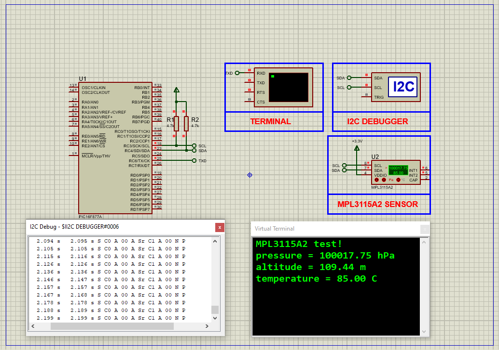

# Interfacing PIC16F877A Microcontroller with MPL3115A2 Sensor for Pressure, Altitude & Temperature Monitoring

This project demonstrates interfacing the **PIC16F877A microcontroller** with the **MPL3115A2 sensor** to accurately measure atmospheric pressure, altitude, and temperature. It is ideal for environmental sensing, weather stations, and navigation applications.

---

## Features

- Measures atmospheric pressure (20 kPa to 110 kPa)  
- Altitude measurement with 0.3 m resolution  
- Temperature measurement with ±1°C accuracy  
- I²C communication interface  
- FIFO buffer with up to 32 samples  
- Programmable interrupts for threshold detection  
- Low power consumption modes  

---

## Hardware Requirements

- **PIC16F877A Microcontroller**  
- **MPL3115A2 Pressure/Altitude Sensor**  
- 16 MHz Crystal Oscillator  
- 3.3V Power supply for sensor, 5V for PIC  
- UART Terminal (e.g., Proteus Serial Terminal)  
- Pull-up resistors (4.7kΩ) for I²C lines (SCL, SDA)  
- Supporting passive components (resistors, capacitors)  

---

## Circuit Diagram

---

## Software Components

### `main.h`
- Contains project-wide definitions  
- Defines oscillator frequency (16 MHz)  
- Includes standard headers  

### `i2c.h`
- I²C communication protocol functions  
- Functions for start, stop, read, write operations  
- MPL3115A2 sensor-specific commands implemented  

### `uart.h`
- UART initialization  
- Functions to send data and strings over UART  

### `MPL3115A2.h`
- Register addresses and bit definitions  
- Initialization and configuration routines  
- Functions to read pressure, altitude, and temperature  

---

## Functional Overview

1. Initialize UART for serial communication output  
2. Initialize MPL3115A2 sensor via I²C with correct settings  
3. Set sea-level pressure reference for accurate altitude  
4. Periodically read pressure, altitude, and temperature data  
5. Format and output readings over UART  
6. Repeat with a delay for steady measurements  

---

## Usage Instructions

1. Connect the hardware as per the provided circuit diagram.  
2. Compile the firmware using your preferred PIC development environment (e.g., MPLAB X).  
3. Program the PIC16F877A microcontroller with the compiled hex file.  
4. Open a UART terminal (e.g., PuTTY) set to 9600 baud, 8N1.  
5. Power on the circuit and observe real-time sensor readings on the terminal.  

---

## Troubleshooting

| Issue                  | Possible Cause                   | Suggested Solution                         |
|------------------------|---------------------------------|--------------------------------------------|
| No UART output         | UART misconfigured or wiring     | Verify UART TX pin connection and baud rate|
| Sensor not detected    | I²C wiring error or wrong address| Check SDA and SCL wiring; confirm device address|
| Unstable readings      | Power supply noise or loose wiring| Add decoupling capacitors; secure connections|
| Incorrect data         | Sensor not properly initialized  | Review sensor initialization code          |

---

## Contributing

Contributions are welcome! Feel free to open issues or submit pull requests to improve functionality, fix bugs, or add new features.

---

## License

This project is licensed under the **MIT License**. See the [LICENSE](LICENSE) file for details.

