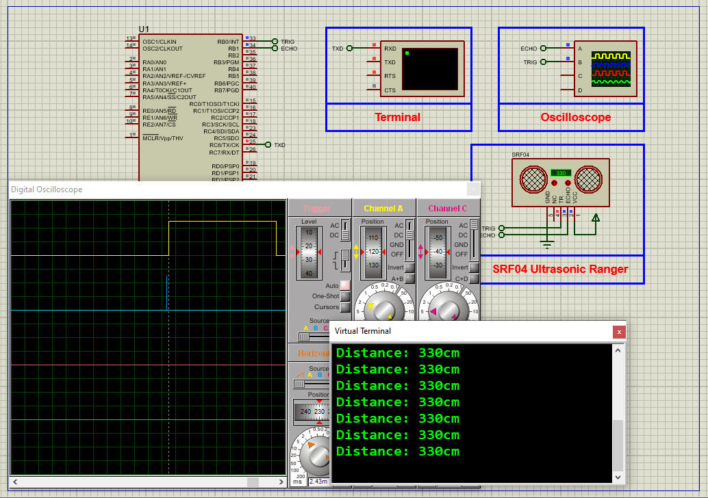

# PIC16F877A Distance Measurement Using SRF04 Ultrasonic Sensor

This embedded project demonstrates interfacing the **SRF04 (HC-SR04 compatible) ultrasonic distance sensor** with a **PIC16F877A microcontroller**. The microcontroller triggers ultrasonic pulses, measures echo return time using **Timer1**, calculates the distance, and displays the result in centimeters on a **16x2 LCD** in real time.

---

## Hardware Requirements

- **PIC16F877A Microcontroller**  
- **SRF04 Ultrasonic Distance Sensor**  
- **16x2 LCD Display**  
- **20 MHz Crystal Oscillator**  
- **Power Supply (5V DC)**  
- **100nF Capacitor** (for power decoupling)  
- **Breadboard & Jumper Wires**

---

## Circuit Overview

- **SRF04 Sensor**  
  - **TRIG** connected to **RB0** (digital output from PIC)  
  - **ECHO** connected to **RB1** (input for pulse width timing)  
  - Powered by **5V** supply  
  - Add 100nF capacitor across VCC-GND for noise suppression

- **PIC16F877A**  
  - **Timer1** used to measure echo duration with microsecond accuracy  
  - LCD connected in 4-bit mode:  
    - Data: **RD4–RD7**  
    - Control: **RC0 (RS)**, **RC1 (RW)**, **RC2 (E)**  
  - **20 MHz Crystal Oscillator** for precise timing

---

## Sensor Specifications

### SRF04 – Ultrasonic Distance Sensor

- **Measurement Range:** 2 cm to 400 cm  
- **Accuracy:** ±3 mm  
- **Trigger Pulse Width:** 10 µs  
- **Echo Output:** Pulse width proportional to distance  
- **Operating Voltage:** 5V DC  
- **Interface Pins:** TRIG (input), ECHO (output)  
- **Distance Formula:**  

  \[
  \text{Distance (cm)} = \frac{\text{Time (µs)}}{58}
  \]

---

## Functional Overview

- **Trigger Signal Generation:**  
  A 10 µs high pulse is sent to TRIG to start a measurement.

- **Echo Pulse Timing:**  
  - Timer1 is started on ECHO rising edge  
  - Timer1 is stopped on falling edge  
  - Duration gives round-trip time of ultrasonic pulse

- **Distance Calculation:**  
  - Time is converted to centimeters using:
    \[
    \text{Distance} = \frac{\text{Time (µs)}}{58}
    \]
  - Final value displayed on LCD

- **LCD Display:**  
  - Shows real-time distance in **centimeters**  
  - Updates every 500 ms for clear, readable output

---

## Software Highlights

- **Timer1** configured for microsecond resolution  
- **Interrupt or polling** used for echo pulse edges  
- **Trigger pulse** generated via digital pin output  
- **LCD interfaced in 4-bit mode** for efficient pin usage  
- **Measurement cycle repeated every 500 ms**

---

## Proteus Simulation Configuration

### Components to Select

- `PIC16F877A`  
- `SRF04 Ultrasonic Sensor Module`  
- `16x2 LCD Display`  
- `100nF Capacitor`  
- `Power Source (5V DC)`  
- `20 MHz Crystal Oscillator`

### Setup Steps

1. Create a new Proteus project.  
2. Add the PIC16F877A and connect power, MCLR, and oscillator.  
3. Connect **TRIG** to **RB0**, **ECHO** to **RB1** of the PIC.  
4. Connect 16x2 LCD: data to **RD4–RD7**, control to **RC0–RC2**.  
5. Load the compiled `.hex` file into the PIC.  
6. Run the simulation — distance in **cm** will be displayed and updated continuously.

---

## Applications

- Object avoidance in robotics  
- Smart parking systems  
- Water level monitoring  
- Intrusion detection and automation  
- Educational embedded system projects

---

## Troubleshooting

| Problem                   | Possible Cause                          | Suggested Solution                              |
|---------------------------|------------------------------------------|--------------------------------------------------|
| No LCD display            | Incorrect wiring or LCD init failure     | Recheck connections and LCD contrast (V0 pin)   |
| Constant zero reading     | TRIG signal not generated                | Confirm RB0 pin and timing code                 |
| Inaccurate distance       | Timer misconfigured or echo timeout      | Verify Timer1 setup and pulse measurement       |
| LCD shows garbled data    | LCD not properly initialized             | Confirm 4-bit mode and initialization sequence  |
| Simulation won’t start    | Missing HEX or oscillator misconfigured  | Reload HEX and double-check crystal connections |

---

## License

**MIT License** – Free to use, modify, and distribute with attribution for educational and commercial use.

