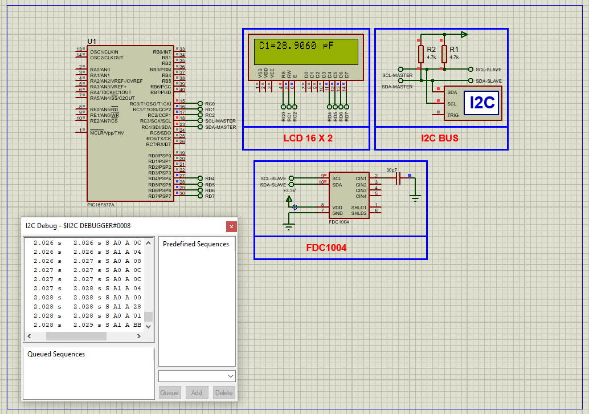

# PIC16F877A Capacitance Sensing Using FDC1004 and LCD Display

This embedded project demonstrates how to interface the **FDC1004 capacitance-to-digital converter** with the **PIC16F877A microcontroller** via the I2C communication protocol. The microcontroller reads accurate capacitance measurements from the FDC1004 sensor and displays the results on a **16x2 LCD screen** in real time.

The system supports dynamic **CAPDAC adjustment** to maintain measurement accuracy across varying capacitance levels.

---

## Hardware Requirements

- **PIC16F877A Microcontroller**  
- **FDC1004 Capacitance Sensor Module**  
- **16x2 LCD Display (Parallel Mode)**  
- **4.7kΩ Pull-up Resistors** (on SDA & SCL lines)  
- **100nF Capacitor** (for power decoupling)  
- **20 MHz Crystal Oscillator**  
- **Power Supply (5V DC)**  
- **Breadboard & Jumper Wires**

---

## Circuit Overview

- **FDC1004 Sensor**  
  - Communicates via I2C  
  - **SDA** connected to **RC4**, **SCL** to **RC3** of PIC16F877A  
  - 4.7kΩ pull-up resistors on both SDA and SCL  
  - Powered by 5V with 100nF capacitor across VCC–GND for noise suppression

- **PIC16F877A**  
  - Uses **MSSP module** for I2C communication  
  - LCD connected in **4-bit mode**: Data on **RD4–RD7**, Control on **RC0–RC2**  
  - Clocked by a **20 MHz crystal oscillator** for precise I2C timing

---

## Sensor Specifications

### FDC1004 – Capacitance-to-Digital Converter

- **Measurement Range:** ±15 pF (with up to 100 pF external capacitance)  
- **Accuracy:** ±0.5 pF typical  
- **Resolution:** 16-bit digital output  
- **Interface:** I2C (7-bit address `0x50`)  
- **Sample Rates:** 100Hz, 200Hz, 400Hz  
- **CAPDAC:** Programmable offset adjustment for high dynamic range  
- **Applications:** Liquid level sensing, proximity detection, capacitive touch

---

## Functional Overview

- **I2C Initialization:**  
  MSSP module initializes the I2C bus at 100 kHz for communication with the FDC1004.

- **Measurement Cycle:**  
  - The PIC configures and triggers measurement on a selected channel.  
  - After conversion delay, it reads the raw 16-bit value from the sensor.  
  - Converts data to **femtofarads (fF)** using Bosch-specified scaling.  
  - Capacitance is then formatted and displayed on the LCD.

- **CAPDAC Auto-Adjustment:**  
  If the measured raw data is out of range, the code increments/decrements the CAPDAC to bring values into an accurate range dynamically.

- **LCD Display:**  
  Shows real-time capacitance value from Channel 1 in **picofarads (pF)** on the first row of the display.

---

## Software Highlights

- **Modular Codebase** with the following header files:
  - `i2c.h`: Contains I2C master functions for read/write and start/stop  
  - `lcd.h`: LCD initialization and text printing functions  
  - `FDC1004.h`: Contains sensor configuration and measurement routines

- **Measurement Processing:**  
  - Raw data scaled using constants: `488` (attofarads/unit) and `3125` (fF/CAPDAC unit)  
  - Output is shown in the format: `C1=12.3456 pF`

- **Dynamic CAPDAC Logic:**  
  Keeps capacitance readings within optimal sensor range by incrementally adjusting offset

---

## Proteus Simulation Configuration

### Components to Use

- `PIC16F877A`  
- `FDC1004 Sensor (I2C)`  
- `16x2 LCD Display`  
- `4.7kΩ Resistors` for SDA/SCL  
- `100nF Capacitor` for decoupling  
- `20 MHz Crystal Oscillator`  
- `I2C Debugger` (optional)  
- `Power and Ground Terminals`

### Setup Steps

1. Open Proteus and create a new project.  
2. Add the following components: **PIC16F877A**, **FDC1004**, **LCD**, **Resistors**, **Capacitor**, **Crystal**, and **I2C Debugger**.  
3. Connect I2C lines:  
   - **SDA → RC4**, **SCL → RC3**  
   - Add 4.7kΩ pull-ups to 5V  
4. Connect LCD in 4-bit mode:  
   - Data: **RD4–RD7**, Control: **RC0–RC2**  
5. Load compiled `.hex` file to the PIC.  
6. Run simulation. Capacitance readings should appear on the LCD.

---

## Applications

- Non-contact liquid level monitoring  
- Capacitive touch/proximity detection  
- Industrial tank and silo measurement  
- Smart bathroom or kitchen fixtures  
- Research and prototyping for capacitive systems

---

## Troubleshooting

| Problem                   | Possible Cause                          | Suggested Solution                              |
|---------------------------|------------------------------------------|--------------------------------------------------|
| LCD shows nothing         | Wiring issue or power fault              | Verify LCD VCC, GND, contrast, and control pins |
| No I2C data from sensor   | Wrong address or missing pull-ups        | Check I2C address (0x50) and use 4.7kΩ pull-ups |
| Always reads 0 pF         | Incorrect CAPDAC or channel config       | Verify sensor init and measurement parameters   |
| Capacitance jumps wildly  | Noise or insufficient delay after trigger| Add capacitor, and use delay after triggering   |
| Simulation won’t start    | Missing HEX file or oscillator setup     | Reload HEX, check 20 MHz crystal & capacitors   |

---

## License

**MIT License** – Free to use, modify, and distribute with attribution. Ideal for educational and development purposes.

