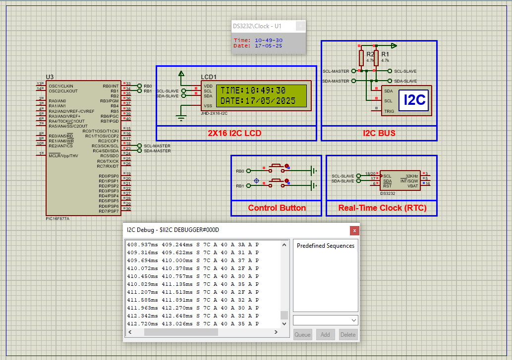

# PIC16F877A Real-Time Clock Display Using DS3231 and LCD

This embedded project demonstrates how to interface the **DS3231 real-time clock (RTC)** module with the **PIC16F877A microcontroller** using the I²C communication protocol. The system continuously displays accurate time and date on a **16x2 I2C LCD screen** and allows user adjustment via push buttons.

The DS3231 features a **built-in crystal oscillator**, **temperature compensation**, and **battery backup**, ensuring precise and uninterrupted timekeeping.

---

## Hardware Requirements

- **PIC16F877A Microcontroller**  
- **DS3231 RTC Module**  
- **16x2 I2C LCD Display**  
- **2x Push Buttons**  
- **4.7kΩ Pull-up Resistors** (on SDA & SCL lines)  
- **16 MHz Crystal Oscillator**  
- **CR2032 Battery** (for DS3231 backup)  
- **Power Supply (5V DC)**  
- **Breadboard & Jumper Wires**

---

## Circuit Overview

- **DS3231 RTC Module**  
  - Communicates via I²C  
  - **SDA** connected to **RC4**, **SCL** to **RC3** of PIC16F877A  
  - 4.7kΩ pull-up resistors on both SDA and SCL  
  - Includes onboard battery backup for power loss resilience

- **PIC16F877A**  
  - Uses **MSSP module** for I²C communication  
  - LCD connected via I2C through PCF8574 interface  
  - Two push buttons connected to **RB0** and **RB1** for time/date setting  
  - Clocked by a **16 MHz crystal oscillator**

---

## RTC Module Specifications

### DS3231 – Real-Time Clock with Temperature Compensation

- **Timekeeping Features:** Seconds, Minutes, Hours, Day, Date, Month, Year  
- **Leap Year Compensation:** Automatically adjusts for leap years  
- **Interface:** I2C (7-bit address `0x68`)  
- **Battery Backup:** Maintains time during power outages  
- **Accuracy:** ±2ppm (±1 minute/year)  
- **Temperature Range:** –40°C to +85°C  
- **Applications:** Clock displays, data loggers, alarms, automation

---

## Functional Overview

- **I2C Initialization:**  
  PIC16F877A initializes the I²C bus using its MSSP module at 100 kHz to communicate with the DS3231 RTC and the I2C LCD.

- **Time Reading and Display:**  
  - Time and date values are read in BCD format from the RTC registers  
  - Converted to decimal and formatted as `TIME: HH:MM:SS` and `DATE: DD/MM/YY`  
  - Displayed on the **16x2 I2C LCD**

- **Time/Date Setting Mode:**  
  - Initiated when **Button1** is pressed  
  - Each field (hour, minute, day, etc.) can be modified with **Button2**  
  - Blinking feedback indicates the current field being edited  
  - Final values written back to the RTC

- **Visual Feedback:**  
  The selected digit blinks while in edit mode, offering intuitive interaction without additional UI components.

---

## Software Highlights

- **Modular Codebase** with the following key files:
  - `i2c.h`: I2C master communication functions  
  - `jhd_lcd.h`: LCD control routines (I2C-based)  
  - `main.c`: Main logic, RTC communication, display updates, user interaction

- **BCD to Decimal Conversion:**  
  Handles RTC data format conversion for display and editing

- **Edit Logic:**  
  Allows cycling through parameters (HH, MM, DD, MM, YY) using push buttons

- **Efficient Display Update:**  
  Continuously reads and formats time every 50 ms for real-time responsiveness

---

## Proteus Simulation Configuration

### Components to Use

- `PIC16F877A`  
- `DS3231 RTC Module`  
- `JHD-2X16 I2C LCD` or PCF8574-based I2C LCD  
- `2x Push Buttons`  
- `4.7kΩ Resistors` (for I2C pull-ups)  
- `16 MHz Crystal Oscillator`  
- `I2C Debugger` (optional)  
- `Power and Ground Terminals`

### Setup Steps

1. Open Proteus and create a new project  
2. Add components: **PIC16F877A**, **DS3231**, **I2C LCD**, **Buttons**, **Resistors**, **Oscillator**, **I2C Debugger**  
3. Wire I2C bus:  
   - **SDA → RC4**, **SCL → RC3**  
   - Pull-up resistors (4.7kΩ) from SDA/SCL to 5V  
4. Connect push buttons to **RB0** and **RB1** with pull-downs or logic handling  
5. Load the compiled `.hex` file into the PIC  
6. Run the simulation to verify time display and button-setting functionality

---

## Applications

- Embedded digital clocks  
- Automated data logging systems  
- Time-stamping in industrial control units  
- Battery-backed scheduling systems  
- Educational microcontroller projects

---

## Troubleshooting

| Problem                   | Possible Cause                          | Suggested Solution                              |
|---------------------------|------------------------------------------|--------------------------------------------------|
| LCD remains blank         | Incorrect I2C address or wiring          | Check LCD I2C address and power connections     |
| Time doesn’t update       | RTC read not functioning properly        | Verify I2C communication and RTC address (0x68) |
| Button press not detected | Button pins not configured or floating   | Use proper pull-ups/pull-downs on RB0/RB1       |
| Wrong time displayed      | BCD decoding error or I2C timing issue   | Check `bcd_to_decimal()` and I2C delays         |
| Simulation won’t start    | Missing HEX file or oscillator settings  | Ensure 16 MHz clock and HEX file are loaded     |

---

## License

**MIT License** – Free to use, modify, and distribute with attribution. Ideal for educational and development purposes.
