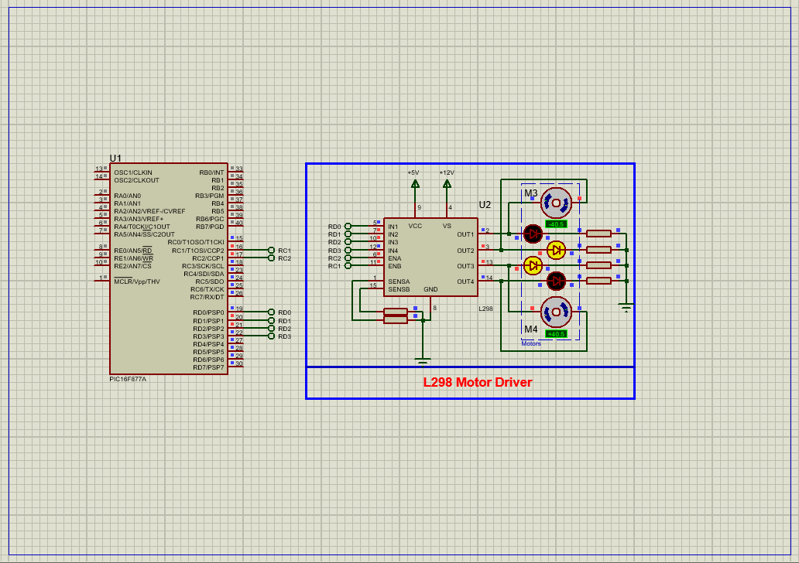

# PIC16F877A Dual DC Motor Control Using L298 Motor Driver

This embedded project demonstrates how to control **two DC motors** using a **PIC16F877A microcontroller** and an **L298 H-Bridge motor driver**. The system utilizes **PWM (Pulse Width Modulation)** signals from the microcontroller to control the **speed** of the motors and digital outputs to control their **direction**.

---

## Hardware Requirements

- **PIC16F877A Microcontroller**  
- **L298 Dual H-Bridge Motor Driver Module**  
- **2x DC Motors**  
- **External Power Supply (12V for Motors)**  
- **5V Regulator (e.g., 7805 for PIC)**  
- **Flyback Diodes (if using discrete L298)**  
- **16 MHz Crystal Oscillator**  
- **Power Supply (5V for PIC, 12V for Motors)**  
- **Breadboard & Jumper Wires**

---

## Circuit Overview

- **L298 Motor Driver Module**  
  - Controls two DC motors via H-Bridge configuration  
  - Accepts PWM signals on **EN1** (Motor A) and **EN2** (Motor B)  
  - Direction controlled using **IN1/IN2** for Motor A, **IN3/IN4** for Motor B  
  - Requires separate motor supply voltage (12V recommended)

- **PIC16F877A**  
  - **RC2 (CCP1)** used for PWM to EN1 (Motor A)  
  - **RC1 (CCP2)** used for PWM to EN2 (Motor B)  
  - **RD0–RD3** used as digital outputs for motor direction control  
  - Clocked using a **16 MHz crystal oscillator**

---

## Motor Driver Specifications

### L298N – Dual H-Bridge Motor Driver

- **Operating Voltage:** 5V (logic), 7–35V (motor)  
- **Output Current:** Up to 2A per channel  
- **Supports Bidirectional Motor Control**  
- **Built-in Diode Protection (on modules)**  
- **Enable Pins (EN1, EN2)** accept PWM for speed control  
- **Direction Pins:** IN1–IN4 determine motor rotation direction

---

## Functional Overview

- **PWM Initialization:**  
  The PIC16F877A uses its **CCP1 and CCP2 modules** with **Timer2** to generate PWM signals. These are sent to **EN1** and **EN2** of the L298 to control motor speed.

- **Direction Control:**  
  Four GPIO pins from **PORTD** are configured as digital outputs.  
  - **IN1/IN2** control direction of Motor A  
  - **IN3/IN4** control direction of Motor B  
  Logic combinations determine **forward**, **backward**, or **stop** state.

- **Speed Control:**  
  Duty cycle values are loaded into the CCPR1L and CCPR2L registers, controlling the average voltage to each motor and thereby their speed.

- **Main Loop Behavior:**  
  The program alternates motor direction every few seconds to demonstrate control. Speed values can be updated dynamically in a more complex implementation.

- **Motor Stop Logic:**  
  Motors are stopped by setting both direction inputs low or by setting PWM duty cycle to zero.

---

## Software Highlights

- **Modular Function Design:**  
  The program features dedicated functions for initializing PWM, setting motor speed, direction, and stopping motors independently.

- **PWM Configuration via CCP Modules:**  
  Uses **CCP1 (RC2)** and **CCP2 (RC1)** channels of PIC16F877A for precise PWM signal generation. Timer2 is configured for consistent PWM frequency.

- **Abstracted Motor Control Logic:**  
  Logical macros (e.g., `FORWARD`, `BACKWARD`) improve code readability and simplify motor direction control.

- **Direction Control:**  
  Separate control routines manage each motor's direction using PORTD. Users can easily adapt these functions for various motion patterns.

- **Speed and Direction Cycling:**  
  Demonstrates alternating motion with variable delay, suitable for simulation and visual feedback in testing environments.

- **Clock and Configuration Bits:**  
  System clock is configured for 16 MHz operation. Essential config bits are set for stable operation (e.g., brown-out reset, watchdog disabled).

- **No External Libraries Used:**  
  Low-level access to registers makes the code lightweight and ideal for learning and hardware-oriented projects.

---

## Proteus Simulation Configuration

### Components to Select

- `PIC16F877A`  
- `L298N Dual H-Bridge Module`  
- `2x DC Motors`  
- `Power Supply (5V and 12V)`  
- `Resistors` (if needed for LEDs or logic conditioning)  
- `Oscillator` (16 MHz Crystal + 22pF Capacitors)  
- `Virtual Terminal` (optional, for debugging)

### Setup Steps

1. Launch Proteus and start a new simulation project  
2. Place the **PIC16F877A**, **L298N**, **DC motors**, **power sources**, and **oscillator**  
3. Connect **RC2 → EN1**, **RC1 → EN2** for PWM signals  
4. Connect **RD0–RD3** to **IN1–IN4** of the L298 for direction control  
5. Wire 12V power to motor supply pins of L298, and 5V to logic  
6. Load compiled HEX file into the PIC  
7. Run the simulation and observe motor rotation direction and speed changes

---

## Applications

- Robotic motor drive systems  
- Automated conveyor belts  
- Remote-controlled vehicles  
- Home automation actuators  
- Educational microcontroller training modules

---

## Troubleshooting

| Problem                  | Possible Cause                          | Suggested Solution                          |
|--------------------------|------------------------------------------|----------------------------------------------|
| Motors not spinning       | No PWM output or incorrect wiring        | Check CCP module setup and L298 connections  |
| Only one motor responds   | Direction or enable pins misconfigured   | Verify EN and IN connections for both motors |
| Motors run at full speed  | PWM not initialized or full duty cycle  | Check PWM duty cycle register values         |
| Motors stutter or jerk    | Power supply not sufficient              | Use dedicated 12V power source for motors    |
| Simulation won't run      | Missing HEX file or timer setup error    | Confirm oscillator, HEX file, and Timer2 config|

---

## License

**MIT License** – Free to use, modify, and distribute with attribution. Ideal for educational and development purposes.
