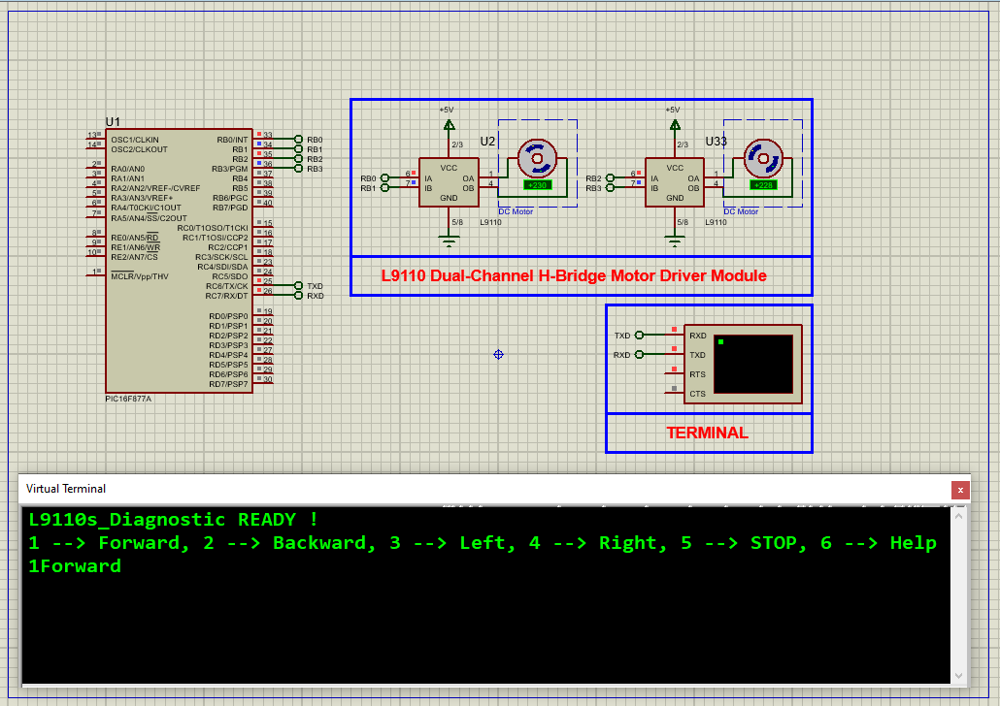

# PIC16F877A L9110 DC Motor Driver Interface

This embedded project demonstrates how to interface the **L9110 Dual DC Motor Driver** with a **PIC16F877A microcontroller** for bidirectional control of two DC motors. The system responds to **UART commands** for forward, backward, left, right, and stop actions, making it suitable for robotics, automation, and educational applications.

---

## Hardware Requirements

- **PIC16F877A Microcontroller**  
- **L9110 Dual H-Bridge Motor Driver Module**  
- **2x DC Motors**  
- **UART to USB Converter** or Virtual Terminal  
- **5V Regulated Power Supply**  
- **16 MHz Crystal Oscillator**  
- **Breadboard & Jumper Wires**

---

## Circuit Overview

- **L9110 Motor Driver**  
  - Controls two motors using four digital signals  
  - IN1/IN2 for Motor A; IN3/IN4 for Motor B  
  - Accepts simple HIGH/LOW signals for direction control

- **PIC16F877A**  
  - **RB0–RB3** used for motor control signals (IN1–IN4)  
  - **RC6 (TX)** used for UART serial output to terminal  
  - **RC7 (RX)** receives command characters from user input  
  - Operates at 16 MHz for stable timing

---

## Motor Driver Specifications

### L9110 – Dual Channel H-Bridge Motor Driver

- **Operating Voltage:** 2.5V to 12V  
- **Continuous Output Current:** Up to 800mA per channel  
- **Logic Level Compatibility:** 3.3V and 5V  
- **Supports Bidirectional Control**  
- **Integrated Diode Protection**  
- **Ideal for Small Motors and Robots**

---

## Functional Overview

- **Motor Initialization:**  
  PORTB pins (RB0–RB3) are configured as outputs to control L9110 input lines. Motors are stopped on startup.

- **UART Communication:**  
  Serial commands are sent via UART to control motor behavior:
  - `1` → Move Forward  
  - `2` → Move Backward  
  - `3` → Turn Left  
  - `4` → Turn Right  
  - `5` → Stop  
  - `6` → Display Help Menu

- **Command Execution:**  
  Incoming UART characters are evaluated in a `switch` statement. Appropriate motor functions are called and feedback is sent back via UART.

- **Motor Control Functions:**  
  Each motor can be controlled independently using direction and simulated speed via delay loops. Composite movements like forward or left combine both motors.

- **Speed Simulation:**  
  Simple delay-based approach mimics PWM-like speed control (for demonstration purposes in simulation).

---

## Software Highlights

- **Header Modularization:**  
  - `main.h` defines clock frequency and configuration bits  
  - `uart.h` abstracts UART functions for reusability

- **UART Communication:**  
  - UART initialized for 9600 baud  
  - Supports text-based terminal control  
  - Functions include byte write, string write, and buffer check

- **Motor Control Abstraction:**  
  - Modular `Motor_Control()` function controls individual motor direction and basic speed simulation  
  - High-level functions (`Motor_Forward()`, `Motor_Stop()`, etc.) manage both motors together

- **Simple Speed Control Simulation:**  
  - Delay loops mimic variable speed behavior  
  - Can be extended to real PWM in hardware for precise speed control

- **User Feedback:**  
  - Informative serial messages are transmitted after every command execution

---

## Proteus Simulation Configuration

### Components to Select

- `PIC16F877A`  
- `L9110 Motor Driver Module`  
- `2x DC Motors`  
- `Terminal` for UART input/output  
- `Power Supply (5V)`  
- `16 MHz Crystal Oscillator`  
- `GND` and `VDD` nodes

### Setup Steps

1. Launch Proteus and create a new project  
2. Place the **PIC16F877A**, **L9110**, **DC motors**, **Terminal**, and **Power Supply**  
3. Connect:  
   - `RB0 → IN1`, `RB1 → IN2` (Motor A)  
   - `RB2 → IN3`, `RB3 → IN4` (Motor B)  
   - `RC6 → TX` to Terminal, `RC7 → RX` from Terminal  
4. Load the compiled HEX file into the PIC16F877A  
5. Run the simulation  
6. Open the virtual terminal and send commands (`1` to `6`)  
7. Observe motor behavior in response to commands

---

## Applications

- Basic robotics (car chassis, mobile robots)  
- DIY automation projects  
- Remote-controlled vehicles  
- Educational embedded systems demos  
- Command-based actuation prototypes

---

## Troubleshooting

| Problem                  | Possible Cause                        | Suggested Solution                        |
|--------------------------|----------------------------------------|--------------------------------------------|
| Motors not responding    | Motor control pins not configured      | Ensure TRISB bits set to output            |
| No UART output           | Baud rate mismatch or wrong TX pin     | Confirm UART settings and wiring           |
| Invalid command errors   | Wrong key press or character encoding  | Use proper ASCII terminal, 9600 baud       |
| Motors only turn one way | Incorrect IN1/IN2 or IN3/IN4 logic     | Double-check pin assignments               |
| Motors won’t stop        | Delay issue or incorrect command       | Ensure '5' command invokes Motor_Stop()    |

---

## License

**MIT License** – Free to use, modify, and distribute with attribution for educational or non-commercial use.
