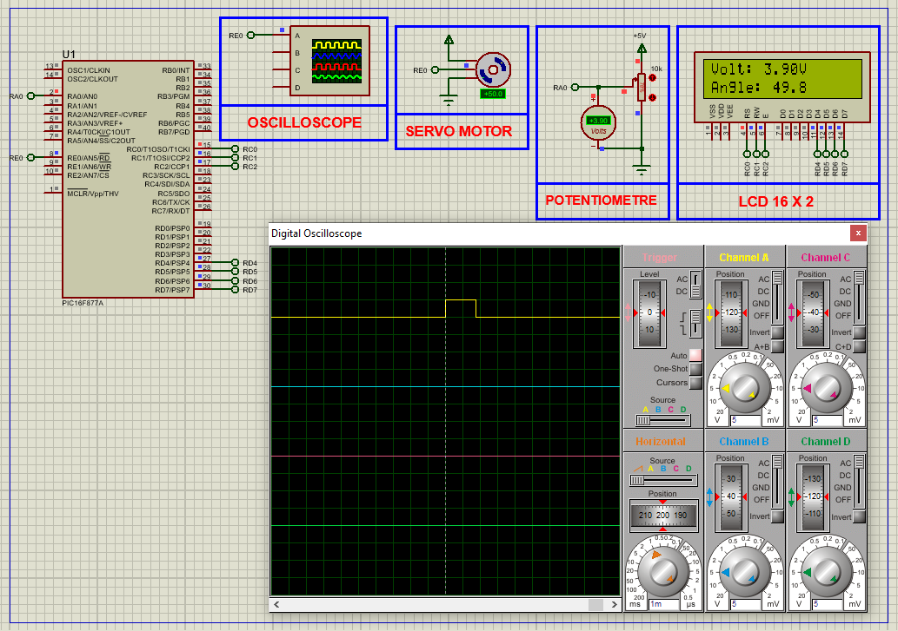

# PIC16F877A Servo Motor Control via PWM (ADC-Based)

This embedded project demonstrates how to control a **servo motor** using the **PIC16F877A microcontroller** by generating **precise PWM signals**. The servo’s angular position is controlled based on **analog input (ADC)** from a potentiometer, making it ideal for **robotics**, **automation**, and **precision control systems**.

---

## Hardware Requirements

- **PIC16F877A Microcontroller**  
- **Standard PWM Servo Motor**  
- **10kΩ Potentiometer** (ADC input)  
- **16x2 LCD Display** (for visual feedback)  
- **5V Regulated Power Supply**  
- **16 MHz Crystal Oscillator**  
- **Breadboard & Jumper Wires**

---

## Circuit Overview

- **Servo Motor Control**  
  - Controlled using a single PWM signal  
  - Pulse width determines angle (1ms to 2ms → 0° to 180°)  
  - PWM signal generated manually using Timer1 and software delay

- **PIC16F877A**  
  - **RE0** used as PWM output pin for servo signal  
  - **RA0 (AN0)** reads analog voltage from potentiometer  
  - **PORTD** connected to 16x2 LCD for angle and voltage display  
  - Operates at 16 MHz for accurate timing and ADC readings

---

## Servo Specifications

### Standard Hobby Servo Motor

- **Operating Voltage:** 4.8V to 6V  
- **Pulse Control Range:** 1ms to 2ms (standard), ~20ms refresh  
- **Control Type:** PWM-based angle positioning  
- **Angle Range:** Typically 0° to 180°  
- **Ideal For:** Pan-tilt systems, robotic arms, gauges

---

## Functional Overview

- **Servo Initialization:**  
  Sets RE0 as digital output. Timer1 initialized for 20ms interval. Default pulse width (~1.5ms) centers servo.

- **Analog Input to PWM Mapping:**  
  Potentiometer input (0–5V) is read through ADC (0–1023). This value is mapped linearly to servo pulse width (109–221 ticks).

- **PWM Signal Generation:**  
  PWM pulse is generated inside the Timer1 interrupt using NOP-based software delay to simulate high pulse duration.

- **LCD Feedback:**  
  Displays live voltage reading and calculated angle (0° to 180°) based on ADC input.

---

## Software Highlights

- **Header Modularization:**  
  - `main.h` defines clock and MCU configuration  
  - `adc.h` handles ADC initialization and reading  
  - `lcd.h` provides LCD control functions

- **PWM Pulse Control:**  
  - Timer1 used for 20ms frame generation  
  - Manual delay loop for high-pulse simulation  
  - Pulse width updated based on potentiometer value

- **ADC Mapping Logic:**  
  - ADC value (0–1023) scaled to pulse width (109–221 ticks)  
  - Angle also derived linearly for display purposes

- **User Feedback via LCD:**  
  - Real-time display of voltage and angle for better debugging and visualization

---

## Proteus Simulation Configuration

### Components to Select

- `PIC16F877A`  
- `MOTOR-PWMSERVO` (Standard Servo)  
- `POT-HG` (10k Potentiometer)  
- `LM016L` or `LCD 16x2`  
- `OSCILLOSCOPE` (Optional for PWM analysis)  
- `Power Supply (5V)`  
- `16 MHz Crystal Oscillator`  
- `GND`, `VDD` nodes

### Setup Steps

1. Launch Proteus and create a new project  
2. Place the **PIC16F877A**, **Servo Motor**, **Potentiometer**, **LCD**, and optional **Oscilloscope**  
3. Connect:  
   - `RA0` to middle pin of potentiometer  
   - `RE0` to Servo Motor signal pin  
   - `PORTD` to LCD (RS, EN, D4–D7)  
   - `Power`, `GND`, and **16 MHz Crystal** with 22pF caps  
4. Load the compiled HEX file into the PIC  
5. Run the simulation  
6. Turn the potentiometer to vary servo angle  
7. Observe changes on servo and LCD display

---

## Applications

- Robotic arms with angular position control  
- Pan-Tilt mechanisms (e.g. for cameras)  
- Analog-controlled servo testers  
- Educational ADC-to-PWM converters  
- Gauge needle simulators

---

## Troubleshooting

| Problem                    | Possible Cause                        | Suggested Solution                          |
|----------------------------|----------------------------------------|----------------------------------------------|
| Servo not moving           | Incorrect PWM pulse width             | Confirm pulse range (109–221 ticks)          |
| Unstable motion            | ADC noise or jitter                   | Add delay or filter ADC values               |
| LCD not displaying         | Wiring or initialization issue        | Check control and data pin connections       |
| Pulse not visible          | Wrong RE0 setup or Timer1 failure     | Confirm RE0 is set as output, check ISR      |
| Angle not accurate         | Incorrect mapping logic               | Recheck pulse width scaling calculations     |

---

## License

**MIT License** – Free to use, modify, and distribute with attribution for educational or non-commercial use.
