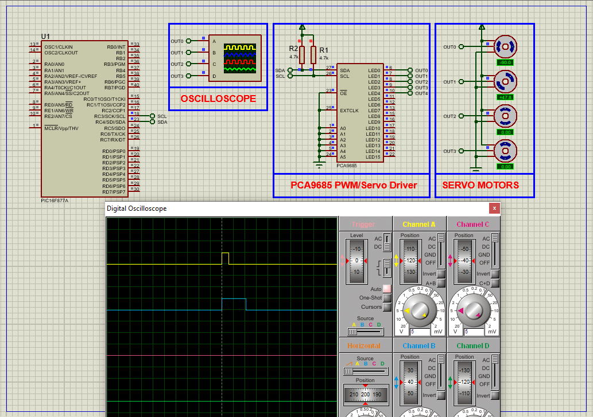

# PIC16F877A PCA9685 PWM Servo Driver Interface

This embedded project demonstrates how to interface the **PCA9685 16-channel PWM Servo Driver** with a **PIC16F877A microcontroller** using the **I²C communication protocol**. The system controls multiple servo motors by generating precise PWM signals, enabling accurate and smooth movement ideal for robotics, automation, and multi-servo control systems.

---

## Hardware Requirements

- **PIC16F877A Microcontroller**  
- **PCA9685 16-Channel PWM Servo Driver Module**  
- **Up to 4 Servo Motors**  
- **Oscilloscope** (optional for PWM signal analysis)  
- **5V Regulated Power Supply**  
- **10kΩ Pull-up Resistors for I²C (SCL, SDA)**  
- **16 MHz Crystal Oscillator**  
- **Breadboard & Jumper Wires**

---

## Circuit Overview

- **PCA9685 PWM Driver**  
  - I²C-based 16-channel 12-bit PWM generator  
  - Independent PWM control per channel  
  - Requires setup of frequency and pulse range  

- **PIC16F877A**  
  - **RC3 (SCL)** and **RC4 (SDA)** connected to PCA9685 I²C bus  
  - Generates I²C commands to set PWM output  
  - Controls servo motors through PCA9685 channels  
  - Operates at 16 MHz for stable I²C timing

---

## PWM Driver Specifications

### PCA9685 – 16-Channel PWM Controller

- **Operating Voltage:** 2.3V to 5.5V  
- **PWM Channels:** 16 independent 12-bit outputs  
- **PWM Frequency:** Adjustable (up to ~1.6 kHz)  
- **Control Interface:** I²C (Standard Mode, 100kHz)  
- **Resolution:** 4096 steps per cycle  
- **Servo Compatibility:** Fully supports hobby servos with 1–2ms pulse width

---

## Functional Overview

- **I²C Communication:**  
  I²C master functions handle communication between PIC16F877A and PCA9685 using standard start/stop/read/write protocol.

- **PWM Initialization:**  
  PCA9685 is configured with the desired frequency (~60 Hz for servo motors). Device is woken from sleep and ready for control.

- **Servo Control Loop:**  
  Servo pulse width ranges from **SERVOMIN (150)** to **SERVOMAX (600)** to simulate 0° to 180° rotation.  
  Multiple servos are swept one after another in a loop for demonstration.

- **Pulse Calculation:**  
  `setServoPulse()` function calculates required 12-bit count from input microseconds and frequency, setting correct PWM range per servo.

---

## Software Highlights

- **Header Modularization:**  
  - `i2c.h` provides reusable I²C communication API  
  - `PWMServoDriver.h` wraps PCA9685 configuration and PWM control functions

- **PWM Control Logic:**  
  - `PWMServoDriver_SetPWM()` directly updates on/off values for servo pins  
  - `PWMServoDriver_WriteMicroseconds()` offers microsecond-based control abstraction

- **Multi-Servo Sweep Demo:**  
  - Servos are moved gradually forward and backward to showcase smooth rotation  
  - Logic loops through channels to cycle across multiple connected servos

---

## Proteus Simulation Configuration

### Components to Select

- `PIC16F877A`  
- `PCA9685 Module` (or custom I²C device symbol)  
- `4x SERVO MOTOR`  
- `Oscilloscope` (Optional)  
- `10kΩ Resistors` (for I²C pull-up on SCL, SDA)  
- `Power Supply (5V)`  
- `16 MHz Crystal Oscillator`  
- `GND` and `VDD` nodes

### Setup Steps

1. Launch Proteus and create a new project  
2. Place **PIC16F877A**, **PCA9685**, **4 Servo Motors**, **Resistors**, and **Oscilloscope**  
3. Connect:
   - `RC3 (SCL)` → PCA9685 SCL with 10kΩ pull-up  
   - `RC4 (SDA)` → PCA9685 SDA with 10kΩ pull-up  
   - PCA9685 PWM outputs (e.g., `PWM0` to `PWM3`) → Servo signal pins  
   - Servo VCC and GND appropriately powered  
4. Add **16 MHz Crystal Oscillator** to PIC with 22pF capacitors  
5. Load the compiled HEX file into the PIC16F877A  
6. Run the simulation  
7. Observe servo movement; monitor PWM signals on oscilloscope if desired

---

## Applications

- Multi-servo robotic arms  
- Pan-tilt camera gimbals  
- Animatronics and puppet control  
- Automated sorting systems  
- Precision servo positioning in industrial tools

---

## Troubleshooting

| Problem                    | Possible Cause                            | Suggested Solution                          |
|----------------------------|--------------------------------------------|----------------------------------------------|
| Servos not moving          | I²C not initialized or wrong address       | Confirm I²C init and use 0x40 address        |
| Jerky or erratic motion    | Wrong PWM frequency or incorrect values   | Ensure 60 Hz PWM, check pulse ranges         |
| No communication           | Missing pull-ups or SCL/SDA miswired      | Add 10kΩ resistors to VCC on I²C lines       |
| Only one servo works       | Channel counter not cycling properly       | Check `servonum` increment logic             |
| Pulse width incorrect      | Bad calculation in `setServoPulse()`      | Recheck math: 1–2ms pulse = 150–600 ticks    |

---

## License

**MIT License** – Free to use, modify, and distribute with attribution for educational or non-commercial use.
