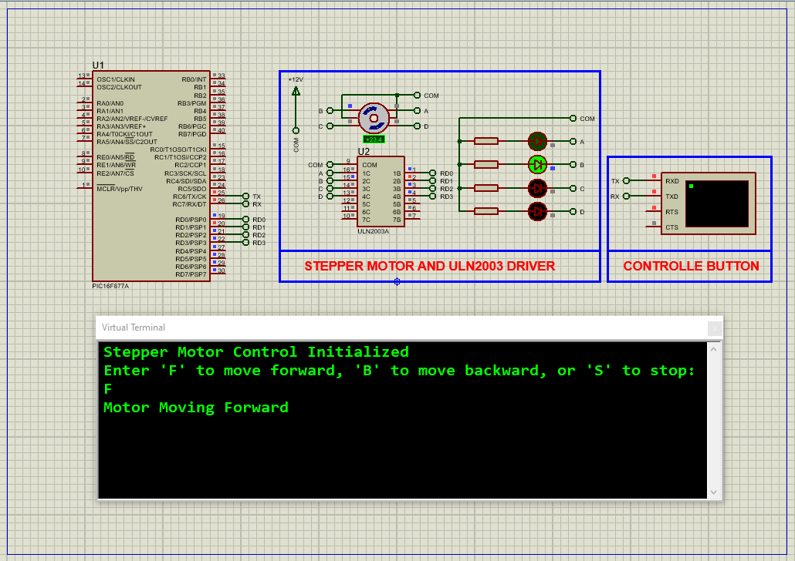

# Stepper Motor Control with PIC16F877A and UART Commands

This embedded project demonstrates how to control a stepper motor using the **PIC16F877A microcontroller**. The motor responds to UART commands to move **forward**, **backward**, or **stop**, making it suitable for applications like robotics and automation where precise motor control is essential.

---

## Hardware Requirements

- **PIC16F877A Microcontroller**  
- **Stepper Motor** (e.g., 28BYJ-48 or similar)  
- **ULN2003A Driver Module** (for motor driving)  
- **Virtual Terminal** (for UART command input during simulation)  
- **5V Regulated Power Supply**  
- **Resistors, LEDs, and other basic components**  
- **Oscilloscope** (optional, for signal verification)  
- **Proteus Simulation Software** (or equivalent for hardware testing)  

---

## Circuit Overview

- **PIC16F877A**  
  - Controls stepper motor phases via PORTD pins  
  - UART configured on RC6 (TX) and RC7 (RX) for serial communication  
  - Connected to ULN2003A driver to power stepper motor coils  

- **ULN2003A**  
  - Acts as a transistor driver for the stepper motor coils  
  - Protects microcontroller from high current load  

---

## Stepper Motor Control Logic

- The motor is driven by an 8-step sequence stored in the array `turn[]`.  
- Motor control commands received over UART include:  
  - `'F'` or `'f'` → Move motor forward  
  - `'B'` or `'b'` → Move motor backward  
  - `'S'` or `'s'` → Stop the motor  
- The system continuously monitors UART input, updating the motor state accordingly.  
- Step delays of 50 ms ensure smooth motor operation.  

---

## Software Highlights

### Configuration and Initialization

- Oscillator set to **8 MHz XT** crystal  
- UART initialized at **9600 baud** with high-speed mode  
- PORTD set as output for stepper motor signals  

### UART Functions

- `UART_TX_Init()` initializes UART for transmission and reception  
- `UART_Write_Text()` sends strings over UART for terminal feedback  
- `UART_Read()` (assumed implemented) reads incoming UART characters  

### Main Control Loop

- Default state is stopped (`command = 'S'`)  
- Upon receiving valid UART commands, motor steps forward/backward or stops  
- Index variable `i` cycles through the stepper sequence array with wraparound for continuous rotation  

---

## Proteus Simulation Configuration

### Components Required

- `PIC16F877A`  
- `ULN2003A` (motor driver)  
- `Stepper Motor (MOTOR-BISTEPPER)`  
- `Virtual Terminal` (for UART commands)  
- `Resistors` and `LEDs` as needed  
- `5V Power Supply` and `Ground`  

### Setup Steps

1. Open Proteus and create a new project.  
2. Add **PIC16F877A**, **ULN2003A**, **Stepper Motor**, and **Virtual Terminal** to the workspace.  
3. Connect PORTD of PIC16F877A to ULN2003A inputs.  
4. Connect ULN2003A outputs to the stepper motor coils.  
5. Set UART pins RC6 (TX) and RC7 (RX) for communication with the Virtual Terminal.  
6. Power the circuit with 5V regulated supply.  
7. Load compiled HEX file into PIC16F877A.  
8. Start simulation and control the stepper motor via terminal commands ('F', 'B', 'S').  

---

## Applications

- Robotics requiring precise stepper motor control  
- Automated conveyor systems  
- CNC machines and 3D printers  
- Pan-tilt camera mounts  
- Industrial automation for position control  

---

## Troubleshooting

| Problem                   | Possible Cause                          | Suggested Solution                             |
|---------------------------|---------------------------------------|-----------------------------------------------|
| Motor does not move        | UART not initialized or incorrect baud rate | Verify UART settings and wiring                |
| Motor moves erratically    | Incorrect step sequence or timing      | Check step array and adjust delay              |
| No response to commands    | UART RX pin misconfigured or no input  | Confirm RX pin setup and terminal connection   |
| Motor only moves one direction | Command logic error or variable overflow | Review command processing and index management |

---

## License

MIT License – Free to use, modify, and distribute with attribution for educational or non-commercial projects.
